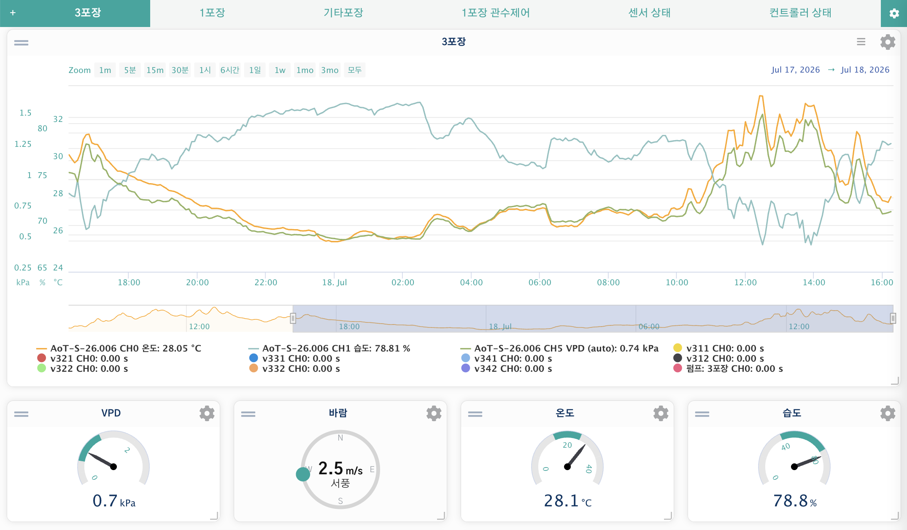

ダッシュボードは、データの可視化と制御を1つのカスタマイズ可能な画面にまとめています。

## データ可視化ツール

### リアルタイム測定 { #live-measurements }

有効になっているすべての入力(Input)・機能(Function)コントローラーの最新データを表示します。ログイン後、最初に表示されるページです。

### 非同期グラフ { #asynchronous-graphs }

週・月・年単位の長期的なデータ分析のために設計されており、各ズームレベルに必要なデータポイントだけを読み込むことで、大量のデータでも高速に動作します。

### ダッシュボード { #dashboard }

ウィジェットを通じてデータ表示とシステム制御を組み合わせた、自由にカスタマイズできるページです。ダッシュボードのウィジェットは情報と操作性を1つにまとめます——センサーの傾向をモニタリングしたり(チャート・ゲージ)、ハードウェアを素早く操作したり(スライダー・スイッチ)、環境データを表示したり(天気・GIS地図)、AIによるインサイトを受け取ったりするために活用します。

#### タブ { #dashboard-tabs }

ダッシュボードは画面上部に並ぶ帯状の**タブ**で構成されています。**各タブはそれぞれ独立したダッシュボード**で、それぞれ独自のウィジェットセットとレイアウトを持つため、用途ごとに画面を分けられます——たとえば「温室A」タブ、「灌水」タブ、「全体概要」タブのようにです。すべてのウィジェットは、必ず1つのタブに属します。

タブはタブバーから管理します。

-   **タブを作成する** — タブバー左端の**`+`**ボタンをクリックします。新しいタブ(「Dashboard N」)が作成され、開きます。
-   **名前の変更 / 削除 / 複製** — タブバー右端の**歯車(設定)**アイコンをクリックすると**ダッシュボード設定**が開きます。名前を編集(重複不可)して**保存**するか、**複製**(タブと*そのすべてのウィジェット*を一緒にコピー)や**削除**を使います。最後に残ったタブを削除すると、新しいタブが自動的に作成されます。
-   **タブの並び替え** — タブバー上でタブを左右に**ドラッグ**します。新しい順序は自動的に保存されます。
-   **タブをロックする** — ダッシュボード設定で**ロック**をクリックすると、配置が固定され編集用のコントロールが非表示になります。再度編集するには**ロック解除**をクリックします。ロックはタブごとに設定されます。

#### ウィジェットの追加と配置 { #dashboard-widgets }

現在のタブが**ロック解除**されている状態で:

-   **ウィジェットを追加する** — ドロップダウンからウィジェットの種類を選び、**ウィジェットを追加**をクリックします。ウィジェットは現在のタブに配置されます。
-   **移動 / サイズ変更** — ウィジェットをドラッグして位置を変えるか、角をドラッグしてサイズを変更します。位置は自動的に保存されます。
-   **ウィジェットを設定する** — ウィジェットの**歯車**アイコンをクリックすると、画面右端からスライドして設定用のドロワーが開きます(スマートフォンでは下部シートとして開きます)。ほとんどのウィジェットには保存ボタンがありません——オプションを変更すると少し間を置いて自動的に適用・保存され、ウィジェットはその場で再描画されます。変更した結果が思い通りにならなかった場合は、ドロワー下部の**되돌리기(元に戻す)**ボタンをクリックすると、ドロワーを開いたときの状態にすべてのオプションを戻せます。AoTマップウィジェットのベースマップや3Dレンダーモードなど、ウィジェットを一から作り直す必要がある一部のオプションは、従来どおりの保存ボタンが必要です。詳しくは下記の[AoTマップ](#widget-map)を参照してください。
-   **ウィジェットを別のタブに移動する** — ウィジェットの設定ドロワーで、**タブ**ドロップダウン(タブが2つ以上あるときに表示されます)から別のタブを選びます。他のオプションと同様、移動も自動的に保存されます。

---

## 主要ウィジェット { #key-widgets }

基本的なチャートやコントロールに加えて、AoTは機能豊富なウィジェットを複数提供しています。代表的なものを以下に挙げます。全カタログは[対応ウィジェット](Supported-Widgets.md)を参照してください。

### AoT マップ { #widget-map }

温室に点在するセンサーやデバイスを1枚の地図上で確認し、その場で操作できます。色付きのマーカーをクリックすると最新の測定値を確認したり、出力をオン/オフに切り替えたりできます。MapLibre GLをベースに構築されており、GISオーバーレイレイヤー、3D地形・施設レンダリング、なめらかなズームに対応しています。


**主要オプション**

-   **地図** — 保存済みの地図を選択するか、代替の緯度・経度とズームレベルを設定します。
-   **3D地図** — デフォルトのピッチ・ベアリング・施設レンダーモード(標準 / ソリッド / ワイヤーフレーム / パフォーマンス)を設定します。
-   **デバイス** — 地図上に表示する入力・出力・機能デバイスを選択します。
-   **測定パネル** — サイドのデータパネルに表示する測定値を選択します。
-   **ラベル** — マスタースイッチの`ラベルを表示`に加え、重なり防止、間隔、文字サイズを設定します。
-   **センサーラベル** — マーカースタイル(円またはテキスト)、小数点以下の桁数、クリックで開く24時間チャートのポップアップ。
-   **図形** — サイト / ゾーン / 施設 / 設備 / デバイスのポリゴン表示を切り替えます。

*特徴:* リアルタイムのセンサー値が3D構造物上に固定表示されるほか、グローバルAIが設定されている場合は、最新のAIアドバイスが地図上部にクリック可能なチップとして表示されます。オプションの全リストと詳細は[AoT_mapウィジェットのページ](geo/map-widget.md)を参照してください。

### AoT 区画 { #widget-plot }

1つの区画の状態——段のタイムライン、現在の測定値と並んだ目標値、傾向、積算温度——をダッシュボードに常駐させます。地図で毎回クリックして確認する代わりに、シーズンを通してずっと注目していたい区画のためのウィジェットです。デバイス制御はあえて含まれていません(それは地図・施設ウィジェットの役割のままです)。どの区画を見るかは、設定ドロワーではなくウィジェット本体の検索可能なドロップダウンから選びます。全体の使い方は[AoT Plotウィジェットのページ](geo/plot-widget.md)を参照してください。

### シーケンスコントローラー { #widget-sequence }

[シーケンス](Functions.md#trigger-sequence)機能を作成すると——たとえば、メインポンプと複数のバルブを順番に動かす灌水ルーチンなど——このウィジェットを使って、ダッシュボードから直接オン/オフを切り替えたり、現在どのステップが実行中かを確認したり、どの曜日に実行するかを制御したりできます。ダッシュボードを離れることなく、バルブの順序を変更したり曜日をオフに切り替えたりできます。


上のスクリーンショットは、実際に稼働している灌水シーケンスです。上部のチェックボックスで曜日ごとの有効/無効を切り替え、その下の項目で開始時刻・終了時刻・周期を確認できます。下部のアクションリストにはバルブが順番に並びます(同じ色のステップは[デバイスグループ](Functions.md#device-groups)です)。タイトル横のトグルで、シーケンス全体を即座にオン/オフに切り替えられます。

**主要オプション**

-   **シーケンス機能** — 制御するシーケンスを選択します。
-   **更新(秒)** — ウィジェットの更新間隔。
-   **アクションリストを表示** — アクションリストを初期状態で表示するかどうか。
-   **シーケンス設定(同期)** — 開始時刻、終了時刻、サイクル周期、起動遅延、ステップ切り替え時間。これらの値は元のシーケンス自体を編集するもので、常にシーケンスと同期しています。

*特徴:* ウィジェット本体には**週間スケジュール**が表示されます——曜日ごとの有効チェックボックスとタップして編集できる曜日セルにより、シーケンスを実行する曜日をダッシュボードから直接設定できます。

### AoTタイマー { #widget-timer }

出力を決まった時間だけオンにし、その後自動的にオフに戻します——完全な[シーケンス](Functions.md#trigger-sequence)を構築しなくても、ポンプやファンを最も簡単に自動化する方法です。たとえば**サイクル**モードで実行20分・休止1時間40分を設定すると、2時間ごとに20分間、決まった回数だけ繰り返して花壇に水をやれます。**シンプル**モードでは代わりに、決まった長さで1回だけ実行します(`0` = 停止するまで実行し続けます)。

**主要オプション**

-   **出力** — 制御する出力チャンネル。
-   **同期(秒)** — ウィジェットがサーバーから動作状態を再取得する間隔。
-   **タイマー** — オン(デフォルト): 下部の時間設定コントロールを表示します。オフ: トグルは実行/休止/サイクル/予約開始の設定を無視して、単純にこの出力をオン/オフするスイッチとしてのみ動作します——このウィジェットを、この出力の単純なスイッチとして使いたい場合に選んでください。
-   **動作モード** — **シンプル**(デフォルト。1回の実行、`0` = 停止するまで実行)または**サイクル**(実行/休止を決まった回数だけ繰り返します)。
-   **サイクル設定** — この出力でタイマーを最初に開始するときに使う実行時間・休止時間・サイクル回数です。それ以降は、実際に最後に実行した値をウィジェットが記憶して再利用するため、一度でも開始したあとはこのデフォルト値が再表示されることはありません。
-   **予約開始(hh:mm)** — デバイスのタイムゾーンにおける時刻での開始時刻です(`00:00` = 即座に開始、過去の時刻を指定すると翌日に予約されます)。
-   **状態を表示** — 現在の段階(実行中 / 休止中 / 予約済み)をタイトルバーに表示します。

*特徴:* サーバー側のバックグラウンドワーカーが実行/休止サイクルを進めるため、ダッシュボードのタブを閉じても止まりません。予約開始時刻を待っている最中にアプリが再起動した場合、その予約は次にダッシュボードが状態を確認したときに自動的に再設定されます——ただし、再起動の時点ですでに実行中または休止中だったサイクルは自動的には再開され**ません**。アプリ再起動後は、その出力の状態を手動で確認してください。

### AoT グラフ { #widget-graph }

複数の測定値を1つの時系列グラフ(Highcharts Stockベース)に重ねて表示し、それらの関係を確認できます。たとえば、温室の1棟の気温・湿度(入力の測定値)を、そのVPD(機能の測定値)や灌水バルブの稼働時間(出力の測定値)と一緒にプロットすれば、気温の急上昇が灌水サイクルと重なっているかどうかを一目で確認できます。



**主要オプション**

-   **時間軸** — 更新間隔、X軸の期間と単位(日 / 時 / 分)、自動更新、ライブウィンドウに戻すX軸リセット。
-   **データソース** — 入力・機能・出力・PID・ノートタグの測定値を複数選択できます(Ctrl / ⌘を押しながら選択)。組み合わせる数に上限はありませんが、カラーパレットは約16色のため、それを超えると追加の系列は同じ代替色を共有します。
-   **グラフスタイル** — ヘッダーボタン・タイトル・ナビゲーター・エクスポート・期間選択・凡例の表示切り替え、要素ごとのフォントサイズ、モバイルでの軸ラベル非表示オプション。
-   **系列ごと**(設定モーダル内) — 任意の色、系列タイプ(線 / ステップ / 棒)、データグループ化の切り替え、Y軸の最小/最大の手動設定(同じ単位を使うすべての系列で共有されます)。

*特徴:* 履歴は**オンデマンド**で読み込まれます——ウィジェットは通常、設定されたウィンドウ分のデータしか保持しませんが、期間ボタン(1m … 3mo / All)を使ったりズームしたりすると、それより前のダウンサンプリングされたデータを取得してマージします。**リセット**ボタンはライブのスライディングウィンドウに戻します。ダッシュボードの外でより長期間の履歴分析を行うには、[非同期グラフ](#asynchronous-graphs)を参照してください。

### AoT サーキュラーゲージ { #widget-gauge }

1つの測定値を、色分けされた帯を持つ円形ゲージで表示します。

**主要オプション**

-   **測定値** — 表示する入力・機能・PIDの測定値。
-   **最小値 / 最大値** — ゲージの範囲。
-   **カラーセクション数** — 円弧を分割する色帯の数(各セクションの色と開始値は設定モーダルで編集します)。
-   **プリセット設定** — カスタム・温度・湿度・VPD。プリセットを選ぶと最小/最大が自動設定され、グローバルな帯の色に従います。
-   **表示** — 小数点以下の桁数、データ/単位のフォントサイズと太さ、値の位置オフセット。

*特徴:* プリセットはグローバルな5段階のパレット(**設定 → Custom UI**)から値を取得し、ゲージ側からそのグローバルな帯の色にセクションの色を反映させることもできます。正しく表示するには、**最大値**を最上部(High)のセクションと一致させてください。

### 関数ステータス { #widget-function-status }

設定で選んだ機能(Function)・条件付き(Conditional)・PIDコントローラーの現在の状態をリアルタイムに表示します。ウィジェットの**詳細**をクリックすると、そのコントローラーの現在の状態を示すモーダルが開き、編集権限があればその場で設定も編集できます——オン/オフのオプションはトグルスイッチ、それ以外は数値または文字の入力欄になります。PIDコントローラーは、AoT PIDウィジェット自体の詳細画面と同じく、通常のチューニング項目(設定値、P/I/Dゲイン、周期、バンド、積分器の制限)を表示します。変更内容はモーダルからすぐに保存されるため、ダッシュボードを離れずに動作中のコントローラーを調整できます。

---

## カスタムウィジェット開発 { #custom-widgets }

AoTはカスタムウィジェットのインポートに対応しています。モジュールは`aot/widgets/`にあります。

カスタムウィジェットを作成するには、JavaScriptを特定の位置に配置する必要があります。次の構造は、複数のウィジェットがダッシュボード上でどのように組み合わされるかを示しています。

```html
<html>
<head>
  <title>Title</title>
  <script>
    {{ widget_1_head }}
    {{ widget_2_head }}
  </script>
</head>
<body>

<div id="widget_1">
  <div id="widget_1_titlebar">{{ widget_title_bar }}</div>
  {{ widget_1_body }}
</div>

<div id="widget_2">
  <div id="widget_2_titlebar">{{ widget_title_bar }}</div>
  {{ widget_2_body }}
</div>

<script>
  {{ widget_1_js }}
  {{ widget_2_js }}

  $(document).ready(function() {
    {{ widget_1_js_ready }}
    {{ widget_2_js_ready }}
  });
</script>

</body>
</html>
```

---

> [!NOTE]
> AIエージェント向けに、構造化されたウィジェットのカテゴリと可視化の詳細情報が`ai_docs/data_viewing.json`にあります。
