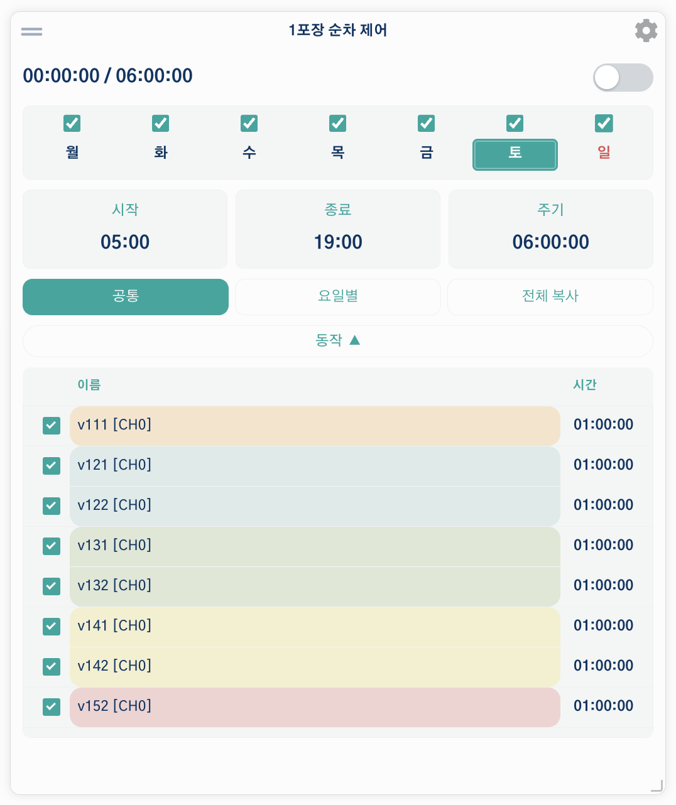

The dashboard combines visualization and control into a single, customizable interface.

## Data Visualization Tools

### Live Measurements { #live-measurements }

Displays the most recent data from all active Input and Function controllers. This is the first page shown after login.

### Asynchronous Graphs { #asynchronous-graphs }

Engineered for long-term data analysis (weeks/months/years), loading only the data points required for each zoom level to stay fast on large data sets.

### Dashboard { #dashboard }

A fully customizable page that combines data views and system controls through widgets. Dashboard widgets intersect information with interactivity — use them to monitor sensor trends (charts, gauges), quickly control hardware (sliders, switches), view environmental data (weather, GIS maps), and receive AI-driven insights.

#### Tabs { #dashboard-tabs }

The dashboard is organized into **tabs**, shown as a strip along the top. **Each tab is an independent dashboard** with its own set of widgets and its own layout, so you can separate screens by purpose — for example a "Greenhouse A" tab, an "Irrigation" tab, and an "Overview" tab. Every widget belongs to exactly one tab.

Manage tabs from the tab strip:

-   **Create a tab** — click the **`+`** button at the left of the tab strip. A new tab ("Dashboard N") is created and opened.
-   **Rename / delete / duplicate** — click the **gear (settings)** icon at the right of the tab strip to open **Dashboard Settings**. Edit the name (must be unique) and **Save**, or use **Duplicate** (copies the tab *and all its widgets*) or **Delete**. Deleting the last remaining tab automatically creates a fresh one.
-   **Reorder tabs** — **drag** a tab left or right in the strip. The new order is saved automatically.
-   **Lock a tab** — in Dashboard Settings, click **Lock** to freeze the arrangement and hide the editing controls. Click **Unlock** to edit again. Locking is per-tab.

#### Adding and arranging widgets { #dashboard-widgets }

With the current tab **unlocked**:

-   **Add a widget** — choose a widget type from the dropdown and click **Add Widget**. The widget is placed on the current tab.
-   **Move / resize** — drag a widget to reposition it, or drag its corner to resize. Positions are saved automatically.
-   **Configure a widget** — click the widget's **gear** icon to open its settings.
-   **Move a widget to another tab** — in the widget's settings, pick a different tab from the **Tab** dropdown (shown when more than one tab exists) and **Save**.

---

## Key Widgets { #key-widgets }

Beyond the basic charts and controls, AoT provides several feature-rich widgets. The most notable are listed below; for the full catalog see [Supported Widgets](Supported-Widgets.md).

### AoT Map { #widget-map }

Displays your devices on an interactive map and highlights their operating state with color. Built on MapLibre GL, it supports vector and raster base maps, GIS overlay layers, and 3D facility rendering.

**Key options**

-   **Map** — select a saved map, or set a fallback latitude/longitude and zoom.
-   **3D map** — enable 3D terrain and set the default pitch, bearing, and facility render mode (Default / Solid / Wireframe / Performance).
-   **Devices** — select which Input, Output, and Function devices appear on the map.
-   **Measurement panel** — choose the measurements shown in the side data panel.
-   **Labels** — a master `Show Labels` switch plus collision prevention, spacing, and text size.
-   **Sensor labels** — marker style (circle or text), decimals, and a click-to-open 24-hour chart popup.
-   **Shapes** — toggle site / zone / facility / equipment / device polygons.

*Notable:* realtime sensor values are anchored on the 3D structures, and — when the global AI is configured — the latest AI advisories appear as clickable chips at the top of the map.

### Sequence Controller { #widget-sequence }

Once you've built a [Sequence](Functions.md#trigger-sequence) function — say, an irrigation routine that runs a main pump plus several valves in order — this widget lets you turn it on and off, see which step is currently running, and control which days it runs, all from the dashboard. You can reorder valves or toggle a day off without leaving the dashboard.



The screenshot above is a real, running irrigation sequence. The checkboxes across the top enable or disable each day of the week, the fields below show the start time, end time, and period, and the action list at the bottom lists the valves in order (steps in the same color are a [device group](Functions.md#device-groups)). The toggle next to the title switches the whole sequence on or off immediately.

**Key options**

-   **Sequence Function** — select the sequence to control.
-   **Refresh (Seconds)** — how often the widget updates.
-   **Show Actions List** — whether the action list is visible by default.
-   **Sequence settings (synced)** — start time, end time, cycle period, startup delay, and step crossing time. These edit the underlying sequence and stay in sync with it.

*Notable:* the widget body shows a **weekly schedule** — per-weekday enable checkboxes with tap-to-edit day cells, so you can set which days the sequence runs directly from the dashboard.

### AoT Timer { #widget-timer }

Runs an output for a duration you enter in hours / minutes / seconds, then turns it off automatically. Entering `0` runs continuously until stopped. An ON/OFF toggle also switches the output directly.

**Key options**

-   **Output** — the output channel to control.
-   **Operation Mode** — **Cycle** (repeat run/rest for a number of cycles) or **Simple** (a single run, `0` = run until stopped).
-   **Cycle settings** — default run time, rest time, and cycle count.
-   **Scheduled Start (hh:mm)** — a wall-clock start time in the device's timezone (`00:00` = start immediately; a past time schedules for the next day).
-   **Display** — show operation status and elapsed run time in the title bar, with adjustable font sizes.

*Notable:* a server-side worker drives the ON/OFF cycles and **survives app restarts** — scheduled timers are re-armed automatically.

### AoT Graph { #widget-graph }

Displays a synchronous time-series graph (built on Highcharts Stock). Selected measurements are plotted over the configured time window.

**Key options**

-   **Time axis** — refresh interval, X-axis duration and unit (day / hour / minute), auto-refresh, and an X-axis reset that snaps back to the live window.
-   **Data sources** — multi-select Input, Function, Output, PID, and Note Tag measurements (hold Ctrl / ⌘ to select several).
-   **Graph style** — toggle the header buttons, title, navigator, export, range selector, and legend, plus per-element font sizes and a mobile axis-label hide option.
-   **Per-series** (in the settings modal) — custom color, series type (line / step / column), data-grouping toggle, and manual Y-axis min/max.

*Notable:* history loads **on demand** — the widget normally holds only the configured window, but using the range buttons (1m … 3mo / All) or zooming fetches earlier, downsampled data and merges it in. The **Reset** button returns to the live sliding window.

### AoT Circular Gauge { #widget-gauge }

Shows a single measurement on a circular gauge with colored bands.

**Key options**

-   **Measurement** — the Input, Function, or PID measurement to display.
-   **Minimum / Maximum Value** — the gauge range.
-   **Number of Color Sections** — how many colored bands the arc is split into (each section's color and start value are edited in the settings modal).
-   **Preset Config** — Custom, Temperature, Humidity, or VPD. Presets automatically set the min/max and follow the global band colors.
-   **Display** — decimal places, data/unit font size and weight, and value position offset.

*Notable:* presets pull from the global 5-band palette (**Settings → Custom UI**), and the gauge can push its section colors back to those global band colors. Make sure the **Maximum Value** matches the top (High) section for correct display.

---

## Custom Widget Development

AoT supports custom widget imports. Modules are located in `aot/widgets/`.

Creating a custom widget requires specific placement of Javascript. The following structure illustrates how multiple widgets are combined on the dashboard:

```html
<html>
<head>
  <title>Title</title>
  <script>
    {{ widget_1_head }}
    {{ widget_2_head }}
  </script>
</head>
<body>

<div id="widget_1">
  <div id="widget_1_titlebar">{{ widget_title_bar }}</div>
  {{ widget_1_body }}
</div>

<div id="widget_2">
  <div id="widget_2_titlebar">{{ widget_title_bar }}</div>
  {{ widget_2_body }}
</div>

<script>
  {{ widget_1_js }}
  {{ widget_2_js }}

  $(document).ready(function() {
    {{ widget_1_js_ready }}
    {{ widget_2_js_ready }}
  });
</script>

</body>
</html>
```

---

> [!NOTE]
> For AI agents, structured widget categories and visualization details are available in `ai_docs/data_viewing.json`.
