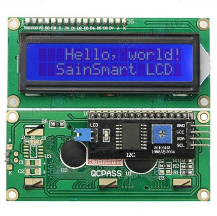
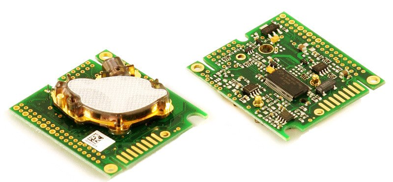
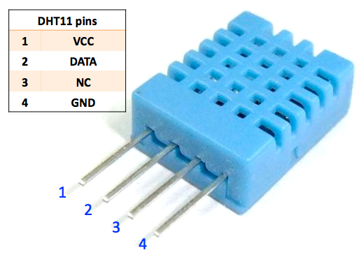
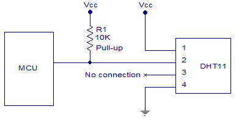
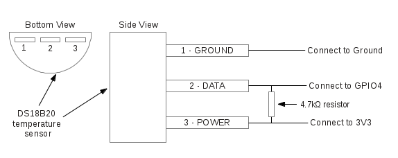
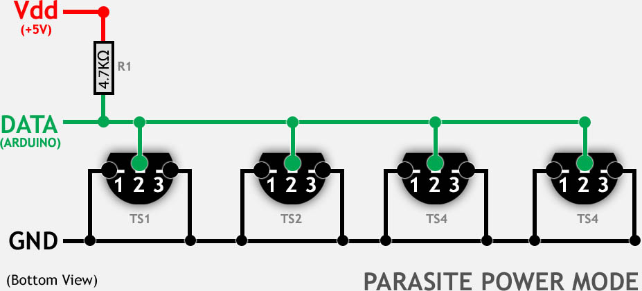
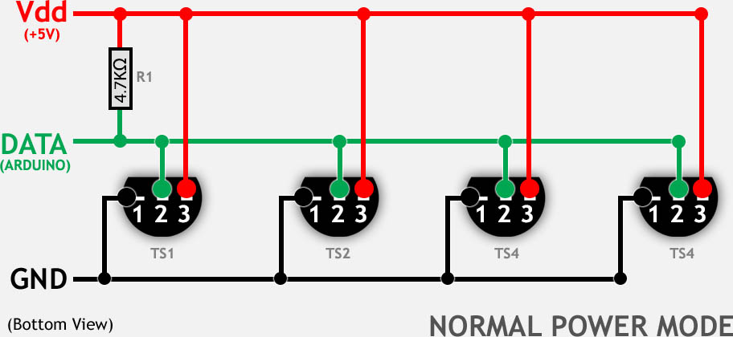
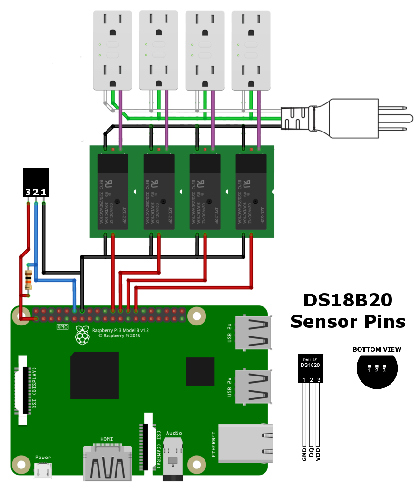
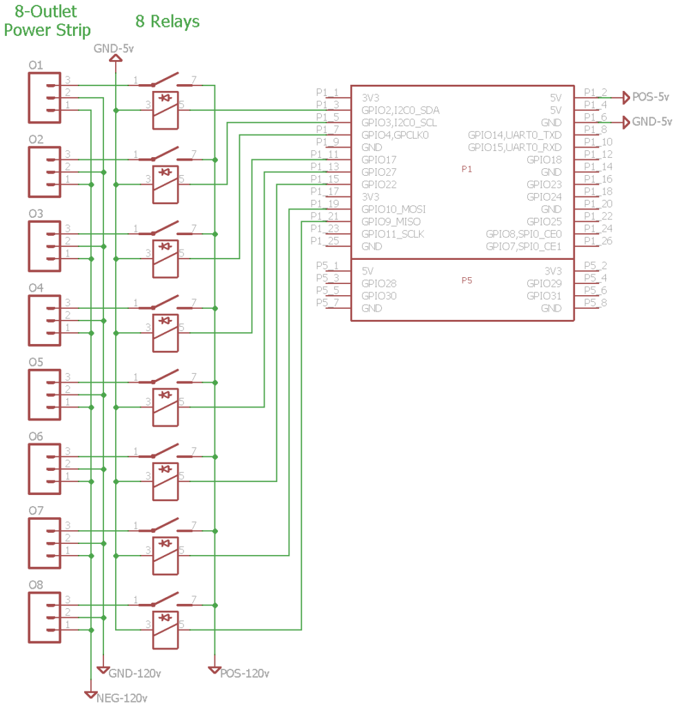

This information may be out of date, so always refer to the manufacturer's recommendations and follow their instructions for operating their devices.

## Edge Detection

Detecting a signal change (for example, a simple switch that completes a circuit) requires edge detection. You can detect a rising edge (LOW to HIGH), a falling edge (HIGH to LOW), or both to trigger an action or event. The GPIO selected to detect the signal must be pulled up to 5 volts or pulled down to ground using an appropriate resistor. For safety reasons, the option to enable an internal pull-up or pull-down resistor is not available. Use your own resistor to pull the GPIO up or down.

Examples of devices that can be used for edge detection: simple switches and buttons, PIR motion sensors, reed switches, Hall effect sensors, float switches, and more.

## Displays

Only a few displays are supported. 16x2 and 20x4 character LCD displays with an I2C backpack, and [128x32](https://www.adafruit.com/product/931) / [128x64](https://www.adafruit.com/product/931) OLED displays are supported. The image below shows a compatible device type with an I2C backpack. For more details, see [Supported Functions](Supported-Functions.md).



## Raspberry Pi

The Raspberry Pi has a temperature sensor integrated into the BCM2835 SoC that measures the temperature of the CPU/GPU. This is the easiest sensor to set up in AoT and is ready to use out of the box.

## AM2315

We figured out why this [AM2315] sensor is unreliable on the Rpi3 hardware I2C. It is one of several I2C devices that dislike the BCM2835 clock stretching issue (a hardware bug: [raspberrypi/linux\#254](https://github.com/raspberrypi/linux/issues/254)). Wakeup attempts consistently fail. After checking the bitstream with a sniffer, we confirmed that the sensor might respond once in 20 attempts (or not at all), but only a single byte is returned. The solution is to use a software implementation of the I2C bus. You need to add a 4.7k pull-up resistor to 3.3v and install the i2c\_gpio device overlay. It now works well, and even after running for several days the CRC errors are gone and accurate readings are obtained every time. There is no need to cycle the sensor's power either.

To enable software I2C, add the following line to `/boot/config.txt`:

`dtoverlay=i2c-gpio,i2c_gpio_sda=23,i2c_gpio_scl=24,i2c_gpio_delay_us=4`

After rebooting, a new I2C bus is created at /dev/i2c-3, with SDA on pin 23 (BCM) and SCL on pin 24 (BCM). Add appropriate pull-up resistors before connecting the device.

## K-30



When connecting the K-30, be very careful, as there is no reverse-voltage protection and an incorrect connection can damage the sensor.

For wiring instructions for the Raspberry Pi, see [here](https://www.co2meter.com/blogs/news/8307094-using-co2meter-com-sensors-with-raspberry-pi).

## Persistence of USB Devices After Reboot

From [(#547) Theoi-Meteoroi](https://github.com/AoT-inc/AoT/issues/547#issuecomment-428752904) on GitHub:

Connecting sensors using USB devices such as a USB-to-serial interface (CP210x) is convenient, but it can cause problems when the system reboots if there are multiple devices. There is no guarantee that a device will keep the same name after a reboot. For example, if sensor A is /dev/ttyUSB0 and sensor B is /dev/ttyUSB1, after a reboot sensor A may become /dev/ttyUSB1 and sensor B may become /dev/ttyUSB0. This can cause AoT to query measurements from the wrong device, resulting in incorrect measurements. Follow the instructions below to resolve this issue.

Use udev to create a persistent device name ('/dev/dust-sensor') linked to the selected /dev/ttyUSBn when the device arrives from the kernel. The only requirement is a unique attribute returned by the USB device. The common case is that the attributes are not unique and only the VID and PID remain. This is fine as long as there is no other adapter reporting the same VID and PID. If you have multiple adapters with the same VID and PID, you'll want to hope that a unique attribute exists. This command explores the attributes. After running it on each USB device, compare the differences to find the attribute to use.

`udevadm info --name=/dev/ttyUSB0 --attribute-walk`

We programmed the USB adapter's serial field using the ZH03B's serial number. This guarantees a unique serial number.

```
pi@raspberry:~ $ udevadm info --name=/dev/ttyUSB0 --attribute-walk | grep serial
SUBSYSTEMS=="usb-serial"
ATTRS{serial}=="ZH03B180904"
ATTRS{serial}=="3f980000.usb"
```

Now we have an attribute to tell udev what to do. Create a file in /etc/udev/rules.d named something like "99-dustsensor.rules". In this file, instruct udev on the device name to create when this device is connected:

`SUBSYSTEM=="tty", ATTRS{idVendor}=="10c4", ATTRS{idProduct}=="ea60", ATTRS{serial}=="ZH03B180904" SYMLINK+="dust-sensor"`

To test the new rule:

```
pi@raspberry:/dev $ sudo udevadm trigger
pi@raspberry:/dev $ ls -al dust-sensor
lrwxrwxrwx 1 root root 7 Oct 6 21:04 dust-sensor -> ttyUSB0
```

Now, whenever the dust sensor is connected, it appears at /dev/dust-sensor.

## Diagrams

### DHT11 Diagram





### DS18B20 Diagram







### Raspberry Pi and Relay Diagrams

#### Raspberry Pi, 4 Relays, 4 Outlets, and 1 DS18B20 Sensor



#### Raspberry Pi, 8 Relays, and 8 Outlets


