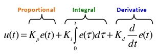
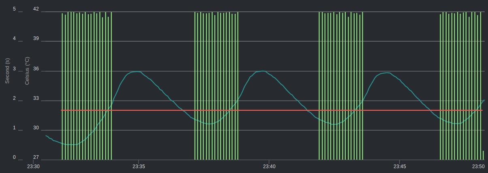

Page: `Setup -> Function`

For a full list of supported functions, see [Supported Functions](Supported-Functions.md).

Function controllers often perform tasks that use inputs and outputs.

!!! note
    "Last" means the function retrieves only the last (most recent) measurement from the database. "Past" means the function retrieves all measurements from the present back to the configured "Max Age (seconds)" (for example, if measurements are collected every 10 seconds and Max Age is set to 60 seconds, then on average 6 measurements are returned for the function to operate on).

## Custom Functions

AoT has a custom function import system that lets user-created functions be used within the AoT system. Custom functions can be uploaded on the `[Gear Icon] -> Configure -> Custom Functions` page. Once imported, they become available on the `Setup -> Function` page.

If you have developed a working function module, consider [creating a new GitHub issue](https://github.com/AoT-inc/AoT/issues/new?assignees=&labels=&template=feature-request.md&title=New%20Module) or a pull request. The module may be included in the built-in set.

To see properly formatted examples, open the built-in modules in the directory [AoT/aot/functions](https://github.com/AoT-inc/AoT/tree/main/aot/functions/).

Additionally, the directory [AoT/aot/functions/examples](https://github.com/AoT-inc/AoT/tree/main/aot/functions/examples) contains custom function examples.

Another GitHub repository dedicated to custom modules not included in the built-in set can be found at [aot-inc/AoT-custom](https://github.com/AoT-inc/AoT-custom).

For functions that require a new measurement/unit, you can add them on the `[Gear Icon] -> Configure -> Measurements` page.

## PID Controller

A [proportional-integral-derivative (PID) controller](https://en.wikipedia.org/wiki/PID_controller) is a control loop feedback mechanism used across industry for system control. It efficiently drives a measurable condition, such as temperature, to a desired state and maintains it there while minimizing overshoot and oscillation. A well-tuned PID controller reaches the setpoint quickly, minimizes overshoot, and holds the setpoint with little oscillation.

PID settings can be changed while the PID is active, and the new settings take effect immediately. If settings are changed while the controller is paused, the changed values are used when the controller resumes operation.

### PID Controller Options

<table>
<thead>
<tr class="header">
<th>Setting</th>
<th>Description</th>
</tr>
</thead>
<tbody>
<tr>
<td>Activate/Deactivate</td>
<td>Turns a particular PID controller on or off.</td>
</tr>
<tr>
<td>Pause</td>
<td>While paused, the control variable is not updated and the PID does not turn on its associated outputs. Settings can be changed without losing the current PID output value.</td>
</tr>
<tr>
<td>Hold</td>
<td>While held, the control variable is not updated but the PID does turn on its associated outputs. Settings can be changed without losing the current PID output value.</td>
</tr>
<tr>
<td>Resume</td>
<td>Resumes the PID controller from the Hold or Pause state.</td>
</tr>
<tr>
<td>Direction</td>
<td>The direction you want to regulate. For example, if you only need to raise temperature, set this to "Raise"; if you need both raising and lowering, set it to "Both".</td>
</tr>
<tr>
<td>Period</td>
<td>The interval at which the PID takes a measurement, updates, and adjusts the output.</td>
</tr>
<tr>
<td>Start Offset (seconds)</td>
<td>The time to wait before attempting the first calculation/measurement.</td>
</tr>
<tr>
<td>Max Age</td>
<td>The maximum allowed age (in seconds) of a sensor measurement. If a measurement is older than this age, the measurement is ignored and the PID does not actuate the output. This is a safety mechanism that ensures the PID uses only recent measurements.</td>
</tr>
<tr>
<td>Setpoint</td>
<td>The specific value you want to regulate the environment to. For example, to regulate humidity to 60%, enter 60.</td>
</tr>
<tr>
<td>Band (+/- Setpoint)</td>
<td>A hysteresis option. When set to a non-zero value, the setpoint becomes a band. The band maximum is setpoint+band and the minimum is setpoint-band. When raising, if the value exceeds the band maximum the PID waits, and resumes regulation once the condition drops below the band minimum. When lowering, if the value drops below the band minimum the PID waits, and resumes regulation once the condition rises above the band maximum. When set to Both, regulation happens only at the outer minimum and maximum of the band and stops within the band. Set to 0 to disable hysteresis.</td>
</tr>
<tr>
<td>Store Lower as Negative</td>
<td>When checked, all output variables (PID and output duration/duty cycle) are stored in the measurement database as negative values. This is useful for showing on a graph whether the PID is currently raising or lowering. Disable to store all values as positive.</td>
</tr>
<tr>
<td>K<sub>P</sub> Gain</td>
<td>The proportional coefficient (≥ 0). Considers the present value of the error. For example, if the error is large and positive, the control output is also large and positive.</td>
</tr>
<tr>
<td>K<sub>I</sub> Gain</td>
<td>The integral coefficient (≥ 0). Considers the past values of the error. For example, if the current output is not strong enough, the integral of the error accumulates over time and the controller applies a stronger response.</td>
</tr>
<tr>
<td>K<sub>D</sub> Gain</td>
<td>The derivative coefficient (≥ 0). Considers the predicted future value of the error based on its current rate of change.</td>
</tr>
<tr>
<td>Integrator Min</td>
<td>The minimum value allowed for the integrator when calculating Ki_total. (Ki_total = Ki * integrator; PID output = Kp_total + Ki_total + Kd_total)</td>
</tr>
<tr>
<td>Integrator Max</td>
<td>The maximum value allowed for the integrator when calculating Ki_total. (Ki_total = Ki * integrator; PID output = Kp_total + Ki_total + Kd_total)</td>
</tr>
<tr>
<td>Output (Raise/Lower)</td>
<td>The output that raises or lowers a particular environmental condition. For example, when raising temperature this might be a heating pad or coil.</td>
</tr>
<tr>
<td>Min On Duration, Duty Cycle, or Amount (Raise/Lower)</td>
<td>The minimum value the PID output must reach before the output is turned on. If the PID output is below this value, a duration output is not turned on and a PWM output is turned off unless Always Min is enabled.</td>
</tr>
<tr>
<td>Max On Duration, Duty Cycle, or Amount (Raise/Lower)</td>
<td>The maximum duration, volume, or duty cycle that can be set on the output. If the PID output exceeds this value, the maximum set here is used.</td>
</tr>
<tr>
<td>Min Off Duration (Raise/Lower)</td>
<td>For on/off (duration) outputs, the minimum time the output must remain off before it can be turned on again. This is useful for devices that can be damaged by rapid power cycling (for example, a refrigerator).</td>
</tr>
<tr>
<td>Always Min (Raise/Lower)</td>
<td>PWM outputs only. When enabled, the duty cycle is never set below the minimum value.</td>
</tr>
<tr>
<td>Setpoint Tracking Method</td>
<td>Configures a method to change the setpoint over time.</td>
</tr>
</tbody>
</table>

### PID Output Calculation

A PID controller can control various output types such as duration, volume, or PWM duty cycle. For most output types the PID output (control variable) acts proportionally (for example, ``output duration = PID control variable``). However, when outputting a duty cycle it is calculated as ``duty cycle = (control variable / period) * 100``.

!!! note
    Control variable = P output + I output + D output. The duty cycle is bounded within the 0–100 % range and the configured Min Duty Cycle and Max Duty Cycle. Output duration is bounded by the configured Min On Duration and Max On Duration, and output volume is bounded similarly.

### PID Tuning

PID tuning can be a complex process depending on the output device used and the environment or system being controlled. A system with large fluctuations is harder to control than a stable one. Likewise, an unsuitable output device can make PID tuning difficult or impossible. Learning how PID controllers work and the theory of tuning will help you not only operate a PID controller better, but also develop the system and select and implement output devices.

#### PID Tuning Resources

- [Sous Vide PID tuning and the unexpected electrical fire](https://hackaday.io/project/11997-aot-environmental-regulation-system/log/45733-sous-vide-pid-tuning-and-the-unexpected-electrical-fire)

#### PID Control Theory

The PID controller is the most commonly used regulatory controller in industrial settings because of its ability to handle control problems ranging from simple to complex. A PID controller has three paths: proportional, integral, and derivative.

**P** (proportional) multiplies the error by the constant K<sub>P</sub> to produce an output value. The larger the error, the larger the proportional output.

**I** (integral) multiplies the error by K<sub>I</sub> and then integrates it (K<sub>I</sub> · 1/s). As the error changes over time, the integral continuously sums it and multiplies by the constant K<sub>I</sub>. The integral is used to remove persistent error in a control system. If using only K<sub>P</sub> produces a persistent error in the output (that is, the sensor measurement fails to reach the setpoint), the integral increases the output value to reduce the error and reach the setpoint.

**D** (derivative) multiplies the error by K<sub>D</sub> and then differentiates it (K<sub>D</sub> · s). As the rate of change of the error varies over time, the output signal changes. The faster the error changes, the larger the derivative path becomes, reducing the rate of change of the output. This has the effect of reducing overshoot and undershoot (oscillation) around the setpoint.


The K<sub>P</sub>, K<sub>I</sub>, and K<sub>D</sub> gains determine how much the P, I, and D variables influence the final PID output value. For example, the larger the gain, the greater the influence of that variable on the output.



The output of a PID controller can be used in several ways. A simple use case is to use this value as the number of seconds the output is turned on during a periodic interval (Period). For example, if the period is set to 30 seconds, the PID equation calculates the PID output every 30 seconds using the desired measurement and the actual measurement. The longer the output is on during that period, the greater the impact on the system. For example, if the output is on for 15 seconds every 30 seconds, that is a 50 % duty cycle, and if it is on for 30 seconds every 30 seconds, that is a 100 % duty cycle with twice the impact on the system. The PID controller calculates the output based on how much the actual measurement differs from the desired measurement (the error). As the error increases or persists, the output increases so that the output stays on longer within the period, which generally reduces the error by changing the measured condition. As the error decreases, the control variable decreases so the output stays on for a shorter time. The ultimate goal of a well-tuned PID controller is to drive the actual measurement to the setpoint quickly, minimize overshoot, and hold the setpoint with minimal oscillation.

Using temperature as an example, the process variable (PV) is the measured temperature, the setpoint (SP) is the desired temperature, and the error (e) is the difference between the measured and desired temperatures (that is, how much the actual temperature is too high or too low). This error is manipulated by each of the three PID components to produce an output called the manipulated variable (MV) or control variable (CV). To control how much each path contributes to the output value, each path is multiplied by a gain (K<sub>P</sub>, K<sub>I</sub>, K<sub>D</sub>). Adjusting the gains affects how sensitively the system responds to each path. Summing all three paths produces the PID output. Setting a gain to 0 means that path contributes nothing to the output and is effectively turned off.

The output can be used in many ways, but this controller is designed to use the output to influence the measured value (PV). This feedback loop, through a *properly tuned* PID controller, can reach the setpoint in a short time, minimize oscillation, and respond quickly to disturbances.

So, if you want to regulate temperature, the sensor is a temperature sensor and the feedback device is a device capable of heating and cooling. If the temperature is below the setpoint, the output value becomes positive and the heater operates. The temperature rises toward the desired temperature, which reduces the error and produces a lower output. This feedback loop continues until the error reaches 0 (at which point the output becomes 0). If the temperature overshoots the setpoint and continues to rise (which may be within an acceptable range), the PID can produce a negative output so that a cooling device lowers the temperature again and reduces the error. If the temperature can lower naturally without the help of a cooling device, you can omit the cooling device and simplify the system.

Implementing a controller that effectively uses K<sub>P</sub>, K<sub>I</sub>, and K<sub>D</sub> can be difficult and is often unnecessary. For example, setting K<sub>I</sub> and K<sub>D</sub> to 0 turns off those paths and produces a very simple P controller. PI controllers are also popular. It is recommended to start with only K<sub>P</sub> enabled, then experiment with combinations of K<sub>P</sub> and K<sub>I</sub>, and finally use all three. Because a system depends on many factors such as the volume of the air space, the degree of insulation, and how much the connected devices influence it, each path must be tuned experimentally to produce an effective output.

#### Quick Setup Examples

These example setups are meant to demonstrate how to configure regulation in a particular direction, not to achieve ideal values for configuring the K<sub>P</sub>, K<sub>I</sub>, and K<sub>D</sub> gains. There are many online resources covering the various techniques and methods developed to determine PID values ([here](http://robotics.stackexchange.com/questions/167/what-are-good-strategies-for-tuning-pid-loops), [here](http://innovativecontrols.com/blog/basics-tuning-pid-loops), [here](https://hennulat.wordpress.com/2011/01/12/pid-loop-tuning-101/), [here](http://eas.uccs.edu/wang/ECE4330F12/PID-without-a-PhD.pdf), [here](http://www.atmel.com/Images/doc2558.pdf)), so it is essential to do your own research and experimentation to understand the variables and implement them effectively.

Just to illustrate the variability of PID values: in one setup, the temperature PID values (raise regulation) were K<sub>P</sub> = 30, K<sub>I</sub> = 1.0, K<sub>D</sub> = 0.5, and the humidity PID values (raise regulation) were K<sub>P</sub> = 1.0, K<sub>I</sub> = 0.2, K<sub>D</sub> = 0.5. Also, although these values were not optimal, they worked well under environmental-chamber conditions.

#### Exact Temperature Regulation

This system uses two regulating devices (one heating, one cooling) to raise and lower temperature to a specific temperature.

Add a sensor, then save the appropriate device and pin/address for each sensor and activate the sensor.

Add two outputs, then save each GPIO and On Trigger state.

Add a PID, then select the newly created sensor. Change the *Setpoint* to the desired temperature and set the *Regulate Direction* to "Both". Set the *Raise Output* to the relay connected to the heating device and the *Lower Relay* to the relay connected to the cooling device.

Set K<sub>P</sub> = 1, K<sub>I</sub> = 0, K<sub>D</sub> = 0, then activate the PID.

If the temperature is below the setpoint, the heater is activated at the interval determined by the PID controller and the temperature rises to the setpoint. When the temperature rises above the setpoint (or setpoint + buffer), the cooling device is activated and the temperature returns to the setpoint. If the temperature does not reach the setpoint, increase the K<sub>P</sub> value and observe its effect on the system. Experiment by adjusting only the *Read Interval* and K<sub>P</sub> to achieve proper regulation. Keep K<sub>I</sub> and K<sub>D</sub> at 0 until regulation works with K<sub>P</sub> alone.

Check the graph over a 6–12 hour time range to see how well the temperature is regulated to the setpoint. "Well regulated" depends on the specific application and tolerance. Most PID controller applications prefer that an appropriate temperature is reached within a reasonable time and that there is little oscillation around the setpoint.

After regulation is achieved, reduce K<sub>P</sub> slightly (~25%) and increase K<sub>I</sub> to a low value (for example, 0.1 or 0.01), start the PID, and observe how well the controller regulates. Slowly increase K<sub>I</sub> to make regulation fast with little oscillation. At this point you are ready to experiment with the system and the K<sub>D</sub> value; experiment with K<sub>D</sub> after K<sub>P</sub> and K<sub>I</sub> are adjusted.

#### High Temperature Regulation

If bidirectional regulation is not required, the system can be simplified. For example, if cooling is unnecessary, it can be removed from the system and only raise regulation used.

Use the same configuration as the [Exact Temperature Regulation](#exact-temperature-regulation) example, but change the *Regulate Direction* to "Raise" and leave the "Down Relay" section untouched.

## PID Autotune

!!! warning
    This feature is experimental. It is recommended to use it after you are familiar with the theory, operation, and tuning of PIDs.

The autotune feature is a standalone controller useful for determining appropriate Kp, Ki, and Kd gains to use in a PID controller. The autotuner manipulates an output and analyzes the measured response of a particular environment/system. To gather enough data to calculate the PID gains, the system must be disturbed several times with the selected output. To use this feature, select a measurement and an output that can adjust the specific measured condition. Then configure the noise band and output step and activate the feature. The autotuner's log appears in the daemon log (`[Gear Icon] -> AoT Logs -> Daemon Log`). While autotuning is being performed, it is recommended to create a dashboard graph including the measurement and output. This lets you see what the PID autotuner is doing and any problems that may arise from the configured autotune settings. If autotuning takes a long time to complete, the system being manipulated may not have enough stability to calculate a reliable set of PID gains. This may be the case when there is too much disturbance in the system or the conditions change too quickly to obtain consistent measurement oscillation. In that case, try modifying the system to increase stability and produce consistent measurement oscillation. Once autotuning completes successfully, further tuning can be performed by reintroducing disturbances so that the PID controller can handle them.

<table>
<thead>
<tr class="header">
<th>Setting</th>
<th>Description</th>
</tr>
</thead>
<tbody>
<tr>
<td>Measurement</td>
<td>The input or function measurement that measures the specific condition the output will affect. For example, it might be a temperature measurement and the output might be a heater.</td>
</tr>
<tr>
<td>Output</td>
<td>The output that will affect the measurement. The autotune feature periodically turns this output on so that the measurement exceeds the setpoint.</td>
</tr>
<tr>
<td>Period</td>
<td>The interval at which the output is turned on. This should be set to the same period you will use for the PID controller. A different period can significantly affect the PID gains the autotune produces.</td>
</tr>
<tr>
<td>Setpoint</td>
<td>The desired measured condition value. For example, when measuring temperature, set it a few degrees above the current temperature so that the temperature exceeds the setpoint when the output is activated.</td>
</tr>
<tr>
<td>Noise Band</td>
<td>The range the measured condition must exceed above the setpoint before the output is turned off. Also, the range the measured condition must fall below the setpoint before the output is turned on again.</td>
</tr>
<tr>
<td>Output Step</td>
<td>The number of seconds the output is turned on each PID period. For example, to autotune at 50% output, set the output step to half the PID period.</td>
</tr>
<tr>
<td>Direction</td>
<td>The direction the output affects the measurement. For example, a heater raises temperature and a cooler lowers it.</td>
</tr>
</tbody>
</table>

A typical graph output looks like this:



And a typical daemon log output looks like this:

```console
2018-08-04 23:32:20,876 - aot.pid_3b533dff - INFO - Activated in 187.2 ms
2018-08-04 23:32:20,877 - aot.pid_autotune - INFO - PID Autotune started
2018-08-04 23:33:50,823 - aot.pid_autotune - INFO -
2018-08-04 23:33:50,830 - aot.pid_autotune - INFO - Cycle: 19
2018-08-04 23:33:50,831 - aot.pid_autotune - INFO - switched state: relay step down
2018-08-04 23:33:50,832 - aot.pid_autotune - INFO - input: 32.52
2018-08-04 23:36:00,854 - aot.pid_autotune - INFO -
2018-08-04 23:36:00,860 - aot.pid_autotune - INFO - Cycle: 45
2018-08-04 23:36:00,862 - aot.pid_autotune - INFO - found peak: 34.03
2018-08-04 23:36:00,863 - aot.pid_autotune - INFO - peak count: 1
2018-08-04 23:37:20,802 - aot.pid_autotune - INFO -
2018-08-04 23:37:20,809 - aot.pid_autotune - INFO - Cycle: 61
2018-08-04 23:37:20,810 - aot.pid_autotune - INFO - switched state: relay step up
2018-08-04 23:37:20,811 - aot.pid_autotune - INFO - input: 31.28
2018-08-04 23:38:30,867 - aot.pid_autotune - INFO -
2018-08-04 23:38:30,874 - aot.pid_autotune - INFO - Cycle: 75
2018-08-04 23:38:30,876 - aot.pid_autotune - INFO - found peak: 32.17
2018-08-04 23:38:30,878 - aot.pid_autotune - INFO - peak count: 2
2018-08-04 23:38:40,852 - aot.pid_autotune - INFO -
2018-08-04 23:38:40,858 - aot.pid_autotune - INFO - Cycle: 77
2018-08-04 23:38:40,860 - aot.pid_autotune - INFO - switched state: relay step down
2018-08-04 23:38:40,861 - aot.pid_autotune - INFO - input: 32.85
2018-08-04 23:40:50,834 - aot.pid_autotune - INFO -
2018-08-04 23:40:50,835 - aot.pid_autotune - INFO - Cycle: 103
2018-08-04 23:40:50,836 - aot.pid_autotune - INFO - found peak: 33.93
2018-08-04 23:40:50,836 - aot.pid_autotune - INFO - peak count: 3
2018-08-04 23:42:05,799 - aot.pid_autotune - INFO -
2018-08-04 23:42:05,805 - aot.pid_autotune - INFO - Cycle: 118
2018-08-04 23:42:05,806 - aot.pid_autotune - INFO - switched state: relay step up
2018-08-04 23:42:05,807 - aot.pid_autotune - INFO - input: 31.27
2018-08-04 23:43:15,816 - aot.pid_autotune - INFO -
2018-08-04 23:43:15,822 - aot.pid_autotune - INFO - Cycle: 132
2018-08-04 23:43:15,824 - aot.pid_autotune - INFO - found peak: 32.09
2018-08-04 23:43:15,825 - aot.pid_autotune - INFO - peak count: 4
2018-08-04 23:43:25,790 - aot.pid_autotune - INFO -
2018-08-04 23:43:25,796 - aot.pid_autotune - INFO - Cycle: 134
2018-08-04 23:43:25,797 - aot.pid_autotune - INFO - switched state: relay step down
2018-08-04 23:43:25,798 - aot.pid_autotune - INFO - input: 32.76
2018-08-04 23:45:30,802 - aot.pid_autotune - INFO -
2018-08-04 23:45:30,808 - aot.pid_autotune - INFO - Cycle: 159
2018-08-04 23:45:30,810 - aot.pid_autotune - INFO - found peak: 33.98
2018-08-04 23:45:30,811 - aot.pid_autotune - INFO - peak count: 5
2018-08-04 23:45:30,812 - aot.pid_autotune - INFO -
2018-08-04 23:45:30,814 - aot.pid_autotune - INFO - amplitude: 0.9099999999999989
2018-08-04 23:45:30,815 - aot.pid_autotune - INFO - amplitude deviation: 0.06593406593406595
2018-08-04 23:46:40,851 - aot.pid_autotune - INFO -
2018-08-04 23:46:40,857 - aot.pid_autotune - INFO - Cycle: 173
2018-08-04 23:46:40,858 - aot.pid_autotune - INFO - switched state: relay step up
2018-08-04 23:46:40,859 - aot.pid_autotune - INFO - input: 31.37
2018-08-04 23:47:55,860 - aot.pid_autotune - INFO -
2018-08-04 23:47:55,866 - aot.pid_autotune - INFO - Cycle: 188
2018-08-04 23:47:55,868 - aot.pid_autotune - INFO - found peak: 32.36
2018-08-04 23:47:55,869 - aot.pid_autotune - INFO - peak count: 6
2018-08-04 23:47:55,870 - aot.pid_autotune - INFO -
2018-08-04 23:47:55,871 - aot.pid_autotune - INFO - amplitude: 0.9149999999999979
2018-08-04 23:47:55,872 - aot.pid_autotune - INFO - amplitude deviation: 0.032786885245900406
2018-08-04 23:47:55,873 - aot.pid_3b533dff - INFO - time:  16 min
2018-08-04 23:47:55,874 - aot.pid_3b533dff - INFO - state: succeeded
2018-08-04 23:47:55,874 - aot.pid_3b533dff - INFO -
2018-08-04 23:47:55,875 - aot.pid_3b533dff - INFO - rule: ziegler-nichols
2018-08-04 23:47:55,876 - aot.pid_3b533dff - INFO - Kp: 0.40927018474290117
2018-08-04 23:47:55,877 - aot.pid_3b533dff - INFO - Ki: 0.05846588600007114
2018-08-04 23:47:55,879 - aot.pid_3b533dff - INFO - Kd: 0.7162385434443115
2018-08-04 23:47:55,880 - aot.pid_3b533dff - INFO -
2018-08-04 23:47:55,881 - aot.pid_3b533dff - INFO - rule: tyreus-luyben
2018-08-04 23:47:55,887 - aot.pid_3b533dff - INFO - Kp: 0.3162542336649691
2018-08-04 23:47:55,889 - aot.pid_3b533dff - INFO - Ki: 0.010165091543194185
2018-08-04 23:47:55,890 - aot.pid_3b533dff - INFO - Kd: 0.7028026111719073
2018-08-04 23:47:55,891 - aot.pid_3b533dff - INFO -
2018-08-04 23:47:55,892 - aot.pid_3b533dff - INFO - rule: ciancone-marlin
2018-08-04 23:47:55,892 - aot.pid_3b533dff - INFO - Kp: 0.21083615577664605
2018-08-04 23:47:55,893 - aot.pid_3b533dff - INFO - Ki: 0.06626133746674728
2018-08-04 23:47:55,893 - aot.pid_3b533dff - INFO - Kd: 0.3644161687558038
2018-08-04 23:47:55,894 - aot.pid_3b533dff - INFO -
2018-08-04 23:47:55,894 - aot.pid_3b533dff - INFO - rule: pessen-integral
2018-08-04 23:47:55,895 - aot.pid_3b533dff - INFO - Kp: 0.49697093861638
2018-08-04 23:47:55,895 - aot.pid_3b533dff - INFO - Ki: 0.0887428626786794
2018-08-04 23:47:55,896 - aot.pid_3b533dff - INFO - Kd: 1.04627757151908
2018-08-04 23:47:55,896 - aot.pid_3b533dff - INFO -
2018-08-04 23:47:55,897 - aot.pid_3b533dff - INFO - rule: some-overshoot
2018-08-04 23:47:55,898 - aot.pid_3b533dff - INFO - Kp: 0.23191977135431066
2018-08-04 23:47:55,898 - aot.pid_3b533dff - INFO - Ki: 0.03313066873337365
2018-08-04 23:47:55,899 - aot.pid_3b533dff - INFO - Kd: 1.0823160212047374
2018-08-04 23:47:55,899 - aot.pid_3b533dff - INFO -
2018-08-04 23:47:55,900 - aot.pid_3b533dff - INFO - rule: no-overshoot
2018-08-04 23:47:55,900 - aot.pid_3b533dff - INFO - Kp: 0.1391518628125864
2018-08-04 23:47:55,901 - aot.pid_3b533dff - INFO - Ki: 0.01987840124002419
2018-08-04 23:47:55,901 - aot.pid_3b533dff - INFO - Kd: 0.6493896127228425
2018-08-04 23:47:55,902 - aot.pid_3b533dff - INFO -
2018-08-04 23:47:55,902 - aot.pid_3b533dff - INFO - rule: brewing
2018-08-04 23:47:55,903 - aot.pid_3b533dff - INFO - Kp: 5.566074512503456
2018-08-04 23:47:55,904 - aot.pid_3b533dff - INFO - Ki: 0.11927040744014512
2018-08-04 23:47:55,904 - aot.pid_3b533dff - INFO - Kd: 4.101408080354794
```

## Conditional Function { #conditional }

Conditional functions are used to perform tasks ranging from simple to complex based on user-created Python code. A conditional function executes Python 3 code and lets you use Conditions and [Actions](Actions.md) within the code to interact with AoT. Conditions are generally used to retrieve data from AoT (for example, input measurements), and Actions are used to affect AoT (for example, actuating an output or pausing a PID controller). Each Condition and Action you add provides a description and example code showing how to use it in the Python code.

!!! note
    `Timeout` should be set longer than the time it takes for `Run Python Code` to execute (if `Timeout` is set too short, only part of the code may run).

!!! note
    `Period` should be set longer than the time it takes for `Run Python Code` to execute. Otherwise, the code runs again before the previous run finishes.

!!! note
    The code runs inside the same Python virtual environment that AoT runs in. Therefore, to use a Python library in your code, you must install the library in that environment. This virtual environment is located at `/opt/AoT/env`, and to install "my_library" with pip, for example, run `sudo /opt/AoT/env/bin/pip install my_library`.

### Conditional Options

<table>
<thead>
<tr class="header">
<th>Setting</th>
<th>Description</th>
</tr>
</thead>
<tbody>
<tr>
<td>Import Python Code</td>
<td>Python 3 code used to import Python libraries. This runs before the class is created when the conditional function code is generated.</td>
</tr>
<tr>
<td>Initialize Python Code</td>
<td>Python 3 code that runs during initialization of the class (inside __init__()). Here you initialize variables to be used within the class.</td>
</tr>
<tr>
<td>Run Python Code</td>
<td>Python 3 code that runs every configured period. This is where conditions and actions are executed. When a Condition or Action is added, a function that can be run for each Condition or Action is shown above that Condition or Action.</td>
</tr>
<tr>
<td>Python Code Status</td>
<td>Can return a dictionary that passes information to other controllers and widgets. For example, the function status widget displays this information on the dashboard. You can remove this code if you do not want to return information.</td>
</tr>
<tr>
<td>Period (seconds)</td>
<td>The period (in seconds) at which `Run Python Code` runs.</td>
</tr>
<tr>
<td>Start Offset (seconds)</td>
<td>The time (in seconds) to wait after the conditional function is activated before it first runs.</td>
</tr>
<tr>
<td>Log Level: Debug</td>
<td>Shows debug lines in the daemon log.</td>
</tr>
<tr>
<td>Include Code in Message</td>
<td>Includes the Python code in the message passed to actions (self.message).</td>
</tr>
</tbody>
</table>

Conditions are functions available within `Run Python Code` that return particular information.

<table>
<thead>
<tr class="header">
<th>Condition</th>
<th>Description</th>
</tr>
</thead>
<tbody>
<tr>
<td>Measurement (Single, Last)</td>
<td>Retrieves the latest measurement from an input or device. You can set a Max Age (seconds) to limit how long a value is accepted. If the latest value is older than this age, "None" is returned.</td>
</tr>
<tr>
<td>Measurement (Single, Past, Average)</td>
<td>Retrieves past measurements from an input or device and then computes the average. You can set a Max Age (seconds) to limit how long a value is accepted. If all values are older than this age, "None" is returned.</td>
</tr>
<tr>
<td>Measurement (Single, Past, Sum)</td>
<td>Retrieves past measurements from an input or device and then computes the sum. You can set a Max Age (seconds) to limit how long a value is accepted. If all values are older than this age, "None" is returned.</td>
</tr>
<tr>
<td>Measurement (Multiple, Past)</td>
<td>Retrieves past measurements from an input or device. You can set a Max Age (seconds) to limit how long a value is accepted. If no value can be found within this age, "None" is returned. Unlike the "Measurement (Single)" condition, this returns a list of dictionaries containing 'time' and 'value' key pairs.</td>
</tr>
<tr>
<td>GPIO State</td>
<td>Retrieves the current GPIO state, returning 1 for HIGH and 0 for LOW. If the latest value is older than this age, "None" is returned.</td>
</tr>
<tr>
<td>Output State</td>
<td>Returns 'on' if the output is currently on, 'off' if it is off.</td>
</tr>
<tr>
<td>Output On Duration</td>
<td>Returns the number of seconds the output has been on. Returns 0 if it is off.</td>
</tr>
<tr>
<td>Controller Running Status</td>
<td>Returns True if the controller is active, False if it is inactive.</td>
</tr>
<tr>
<td>Sun: Day or Night</td>
<td>Returns True when it is currently daytime at the location, False at night. The location is inherited from this Conditional Function's position on the map (falling back to its zone or site), so no coordinates are configured here. The sunrise and sunset offsets (minutes) shift each end of the daytime window — a sunset offset of -30 treats the last 30 minutes before sunset as night. Under the midnight sun it is always True; during polar night, always False.</td>
</tr>
<tr>
<td>Sun: Time Until Event</td>
<td>Returns the number of seconds until the next selected sun event (sunrise, sunset, solar noon, civil dawn, civil dusk). A negative event offset (minutes) counts down to a point before the event — -60 returns the seconds remaining until one hour before the event. The location is inherited from the Conditional Function. If the event does not occur on that date (polar regions), "None" is returned.</td>
</tr>
<tr>
<td>Max Age (seconds)</td>
<td>The maximum age (in seconds) a measurement can have. If the last measurement is older than this, "None" is returned instead of the measurement.</td>
</tr>
</tbody>
</table>

### Conditional Setup Guide

These conditional functions run in a Python 3 environment. The following functions are available within the Python code.

!!! note
    Python code indentation must use 4 spaces (2 spaces, tabs, etc. cannot be used).

The following are some examples that can be used in conditional functions. Each `self.condition("ID")` returns the latest measurement for that condition, and returns a value only if it is within the configured Max Age.

```python
# Example 1: When a measurement is None
# Useful for running an email-notification action when an input is not working.
if self.condition("asdf1234") is None:
    self.run_all_actions()  # Run all actions

# Example 2: Test two measurement conditions
measure_1 = self.condition("asdf1234")
measure_2 = self.condition("hjkl5678")
if None not in [measure_1, measure_2]:
    # When both measurements are not None
    if measure_1 < 20 and measure_2 > 10:
        self.run_all_actions()  # Run all actions

# Example 3: Test two measurements and their sum
measure_1 = self.condition("asdf1234")
measure_2 = self.condition("hjkl5678")
if None not in [measure_1, measure_2]:
    sum_ = measure_1 + measure_2
    if measure_1 > 2 and 10 < measure_2 < 23 and sum_ < 30.5:
        self.run_all_actions()

# Example 4: Combine conditions
measurement = self.condition("asdf1234")
if measurement is not None and 20 < measurement < 30:  # Combined condition
    self.run_all_actions()

# Example 5: Test two measurements
# Convert an Edge Input from 0 or 1 to True or False
measure_1 = self.condition("asdf1234")
measure_2 = self.condition("hjkl5678")
if None not in [measure_1, measure_2]:
    if bool(measure_1) and measure_2 > 10:
        self.run_all_actions()

# Example 6: "or" condition and a rounded measurement test
measure_1 = self.condition("asdf1234")
measure_2 = self.condition("hjkl5678")
if None not in [measure_1, measure_2]:
    if measure_1 > 20 or int(round(measure_2)) in [20, 21, 22]:
        self.run_all_actions()

# Example 7: Use self to store a variable across runs
measurement = self.condition("asdf1234")
if not hasattr(self, "stored_measurement"):  # Initialize the variable
    self.stored_measurement = measurement
if measurement is not None:
    if abs(measurement - self.stored_measurement) > 10:
        self.run_all_actions()  # When the difference is greater than 10
    self.stored_measurement = measurement  # Store the measurement
```

The "Measurement (Multiple)" condition is useful when you want to check whether a particular value occurred in the past within the configured Max Age, not just the last measurement. This can be used, in an alert system where each numeric value represents a different alert to check, to verify whether a particular value occurred among the past values. Below is an example that retrieves all measurements from the past 30 minutes (Max Age: 1800 seconds) and checks whether a value such as "119" exists in the returned list. If "119" exists, an action runs and `break` exits the `for` loop.

```python
# Example 1: Find a specific value among measurements from the past 30 minutes (Max Age: 1800 seconds)
measurements = self.condition_dict("asdf1234")
if measurements:  # If the list is not empty
    for each_measure in measurements:  # Iterate over each measurement in the list
        if each_measure['value'] == 119:
            self.logger.info("Alert 119 was found at timestamp {time}.".format(
                time=each_measure['time']))
            self.run_all_actions()
            break  # Exit the for loop
```

Advanced conditional `Run Python Code` examples:

These examples extend the basic examples above to activate specific actions. The following examples use actions that reference IDs found in the `Actions` section of the conditional function. Two example action IDs are used: "qwer1234" and "uiop5678". Additionally, self.run_all_actions() is used here, which runs all actions in the order they were created.

```python
# Example 1
measurement = self.condition("asdf1234")
if measurement is None:
    self.run_action("qwer1234")
elif measurement > 23:
    self.run_action("uiop5678")
else:
    self.run_all_actions()

# Example 2: Test two measurements
measure_1 = self.condition("asdf1234")
measure_2 = self.condition("hjkl5678")
if None not in [measure_1, measure_2]:
    if measure_1 < 20 and measure_2 > 10:
        self.run_action("qwer1234")
        self.run_action("uiop5678")

# Example 3: Test two measurements and their sum
measure_1 = self.condition("asdf1234")
measure_2 = self.condition("hjkl5678")
if None not in [measure_1, measure_2]:
    sum_ = measure_1 + measure_2
    if measure_1 > 2 and 10 < measure_2 < 23 and sum_ < 30.5:
        self.run_action("qwer1234")
    else:
        self.run_action("uiop5678")

# Example 4: Combine into one condition
measurement = self.condition("asdf1234")
if measurement is not None and 20 < measurement < 30:
    self.run_action("uiop5678")

# Example 5: Test two measurements, convert an Edge input from 0/1 to True/False
measure_1 = self.condition("asdf1234")
measure_2 = self.condition("hjkl5678")
if None not in [measure_1, measure_2]:
    if bool(measure_1) and measure_2 > 10:
        self.run_all_actions()

# Example 6: "or" condition and a rounded measurement test
measure_1 = self.measure("asdf1234")
measure_2 = self.measure("hjkl5678")
if None not in [measure_1, measure_2]:
    if measure_1 > 20 or int(round(measure_2)) in [20, 21, 22]:
        self.run_action("qwer1234")
        if measure_1 > 30:
            self.run_action("uiop5678")
```

If an action is a type that receives a message (E-Mail or Note), you can modify that message to include additional information. This passes new information to the function before it is delivered as a Note, E-Mail, and so on. To do this, add a string to the variable `self.message` and add it to the `message` parameter of `self.run_action()` or `self.run_all_actions()`. Below are some examples. Note the use of `+=` instead of `=` to append a string to the variable `self.message`. This appends without overwriting the existing value.

```python
# Example 1
measurement = self.measure("asdf1234")
if measurement is None and measurement > 23:
    self.message += "The measurement is {}".format(measurement)
    self.run_action("uiop5678", message=self.message)

# Example 2
measure_1 = self.measure("asdf1234")
measure_2 = self.measure("hjkl5678")
if None not in [measure_1, measure_2]:
    if measure_1 < 20 and measure_2 > 10:
        self.message += "Measurement 1: {m1}, Measurement 2: {m2}".format(
            m1=measure_1, m2=measure_2)
        self.run_all_actions(message=self.message)
```

Logging can also be used to record messages to the daemon log using `self.logger`. Logging levels include "info", "warning", "error", and "debug". Debug log lines appear in the daemon log only when the input's logging level is set to "Debug".

```python
# Example 1
measurement = self.measure("asdf1234")
if measurement is None and measurement > 23:
    self.logger.error("Warning, the measurement is {}".format(measurement))
    self.message += "The measurement is {}".format(measurement)
    self.run_action("uiop5678", message=self.message)
```

Before activating a conditional, it is recommended to thoroughly explore all possible scenarios and plan a configuration that eliminates conflicts. Some devices or outputs may react abnormally or fail if turned on and off rapidly. Therefore, perform a dry run of the configuration before connecting the device to the output.

## Trigger

A trigger controller runs actions when an event is triggered, such as an output turning on or off, a GPIO pin changing voltage state (edge detection, rising or falling), a time event including various timers (duration, time interval, specific time, and so on), or an event such as the sunrise/sunset time at a particular latitude and longitude. Once a trigger is configured, add as many [actions](Actions.md) to run when that event is triggered as you want.

### Output (On/Off) Options

Monitors an output's state.

<table>
<thead>
<tr class="header">
<th>Setting</th>
<th>Description</th>
</tr>
</thead>
<tbody>
<tr>
<td>Output Condition</td>
<td>The output whose state change is monitored.</td>
</tr>
<tr>
<td>State Condition</td>
<td>The condition is triggered when the output state changes to On or Off. Selecting "On (any duration)" triggers the condition regardless of how long the output is on, while selecting only "On" triggers the condition only when the output is on for the configured "Duration (seconds)".</td>
</tr>
<tr>
<td>Duration Condition (seconds)</td>
<td>When "On" is selected, you can set the condition to trigger only when the output is on for a specific duration (seconds).</td>
</tr>
</tbody>
</table>

### Output (PWM) Options

Monitors a PWM output's state.

<table>
<thead>
<tr class="header">
<th>Setting</th>
<th>Description</th>
</tr>
</thead>
<tbody>
<tr>
<td>Output Condition</td>
<td>The output whose state change is monitored.</td>
</tr>
<tr>
<td>State Condition</td>
<td>The conditional action is triggered when the output's duty cycle is greater than, less than, or equal to the configured value.</td>
</tr>
<tr>
<td>Duty Cycle Condition (%)</td>
<td>The reference value to compare the output's duty cycle against.</td>
</tr>
</tbody>
</table>

### Edge Options

Monitors the rising and/or falling edge of a pin state.

<table>
<thead>
<tr class="header">
<th>Setting</th>
<th>Description</th>
</tr>
</thead>
<tbody>
<tr>
<td>On Edge Detection</td>
<td>The condition is triggered when a state change is detected. You can select a rising edge when the state changes from LOW (0 volts) to HIGH (3.5 volts), a falling edge when the state changes from HIGH (3.3 volts) to LOW (0 volts), or both rising and falling.</td>
</tr>
</tbody>
</table>

### Run PWM Method Options

When a duration method is selected, the selected PWM output is set to the duty cycle specified by the method.

<table>
<thead>
<tr class="header">
<th>Setting</th>
<th>Description</th>
</tr>
</thead>
<tbody>
<tr>
<td>Duration Method</td>
<td>Select the method to use.</td>
</tr>
<tr>
<td>PWM Output</td>
<td>Select the PWM output to use.</td>
</tr>
<tr>
<td>Period (seconds)</td>
<td>Select the time interval over which the duty cycle is calculated, then applied to the PWM output.</td>
</tr>
<tr>
<td>Trigger Every Period</td>
<td>Triggers the conditional action every period.</td>
</tr>
<tr>
<td>Trigger When Activated</td>
<td>Triggers the conditional action when the conditional is activated.</td>
</tr>
</tbody>
</table>

### Sunrise/Sunset Options

Triggers an event at sunrise or sunset (or an offset thereof) based on latitude and longitude.

<table>
<thead>
<tr class="header">
<th>Setting</th>
<th>Description</th>
</tr>
</thead>
<tbody>
<tr>
<td>Sunrise or Sunset</td>
<td>Select when to trigger the conditional. Choose either sunrise or sunset.</td>
</tr>
<tr>
<td>Latitude (decimal)</td>
<td>Enter the latitude of the sunrise/sunset in decimal format.</td>
</tr>
<tr>
<td>Longitude (decimal)</td>
<td>Enter the longitude of the sunrise/sunset in decimal format.</td>
</tr>
<tr>
<td>Zenith</td>
<td>Set the zenith angle of the sun.</td>
</tr>
<tr>
<td>Date Offset (days)</td>
<td>Set a date offset for the sunrise/sunset time (positive or negative).</td>
</tr>
<tr>
<td>Time Offset (minutes)</td>
<td>Set a time offset for the sunrise/sunset time (positive or negative).</td>
</tr>
</tbody>
</table>

### Timer (Duration) Options

Runs a timer that triggers the conditional action every configured period.

<table>
<thead>
<tr class="header">
<th>Setting</th>
<th>Description</th>
</tr>
</thead>
<tbody>
<tr>
<td>Period (seconds)</td>
<td>The time interval (seconds) at which the conditional action is triggered.</td>
</tr>
<tr>
<td>Start Offset (seconds)</td>
<td>The time (seconds) to wait after the conditional is activated before the first trigger runs.</td>
</tr>
</tbody>
</table>

### Timer (Daily Specific Time) Options

Runs a timer that triggers the conditional action at a specific time every day.

<table>
<thead>
<tr class="header">
<th>Setting</th>
<th>Description</th>
</tr>
</thead>
<tbody>
<tr>
<td>Start Time (HH:MM)</td>
<td>Set the time to trigger the conditional action in "HH:MM" format. HH is the hour and MM is the minute, entered in 24-hour format.</td>
</tr>
</tbody>
</table>

### Timer (Daily Time Span) Options

Runs a timer that triggers the conditional action at a specific period between the configured start and end times. For example, setting the start time to 10:00, the end time to 11:00, and the period to 120 seconds triggers the conditional action every 120 seconds between 10:00 and 11:00.

This is useful when an output must remain on during a specific time and you want to prevent a simple specific-time timer from having its cycle interrupted by a power failure. For example, setting the output to turn on every few minutes during the start -> end time can help ensure the output is maintained during that time.

<table>
<thead>
<tr class="header">
<th>Setting</th>
<th>Description</th>
</tr>
</thead>
<tbody>
<tr>
<td>Start Time (HH:MM)</td>
<td>Set the start time to trigger the conditional action in "HH:MM" format. HH is the hour and MM is the minute, entered in 24-hour format.</td>
</tr>
<tr>
<td>End Time (HH:MM)</td>
<td>Set the end time to trigger the conditional action in "HH:MM" format. HH is the hour and MM is the minute, entered in 24-hour format.</td>
</tr>
<tr>
<td>Period (seconds)</td>
<td>The time interval (seconds) at which the conditional action is triggered.</td>
</tr>
</tbody>
</table>

## Trigger - Sequence

A **Sequence** turns several output devices (valves, pumps, lights, and so on) on and off automatically, in a fixed order and timing. Use it to automate work that happens in stages — "open valve A for 30 minutes, then valve B, then valve C" — instead of switching each device by hand. It is especially useful for irrigation cycles and multi-stage ventilation (open a vent → wait → turn on a fan).

### Worked Example: A Main Pump + 3 Sequential Valves

Here is the most common use case. Say you have one main irrigation pump and valves A, B, and C that should water three zones in order. You want:

- The **pump** to stay on continuously for the whole irrigation run.
- **Valves A → B → C** to each run for 30 minutes in turn, then switch off automatically.

To set this up:

1. Add a new **Sequence** function from the function list.
2. Under **Add Action**, choose "Output: On/Off/Duration", pick the main pump's output, and add it. Set its mode to **Total** — this mode is for a device that must stay on for as long as the whole sequence is running.
3. Add valves A, B, and C in that order. Set each one's mode to **Single**, with a duration of 1800 seconds (30 minutes).
4. Once saved, the steps run in the order you added them (you can also drag to reorder them in the widget).

Here is what that looks like over time:

| Elapsed time | 0–30 min | 30–60 min | 60–90 min |
| :--- | :---: | :---: | :---: |
| Pump (Total) | ON | ON | ON |
| Valve A (Single) | ON → OFF | | |
| Valve B (Single) | | ON → OFF | |
| Valve C (Single) | | | ON → OFF |

The **Total** mode pattern is meant for exactly one device (usually the main pump) that must stay on until everything else finishes; the rest of the steps run in **Single** mode, one after another.

Left at the defaults, the pump switches on at the **same instant** as valve A and off at the same instant as valve C. Running a pump against a closed valve, or closing a valve while the pump is still running, is hard on the plumbing — so give the pump step a **margin (lead / lag)** to hold its window inside the valves'. See [Margins](#total-margins) below.

### Worked Example: Opening Several Valves at Once

What if, in the example above, you wanted valves B and C to open **at the same time** instead of one after the other? Group the two steps into a **device group**. In the widget or the unified modal, enter the same group name (for example, `zone2`) in both valves' group field, and they collapse into a single slot that turns on and off together.

| Elapsed time | 0–30 min | 30–60 min |
| :--- | :---: | :---: |
| Pump (Total) | ON | ON |
| Valve A (Single) | ON → OFF | |
| Valves B + C (group `zone2`) | | ON → OFF (together) |

You can freely mix sequential steps (the pump and Single steps) with simultaneous steps (device groups). Grouped valves share a single duration — see [Device Groups](#device-groups) below for the full rules.

### Modes: Single vs. Total

- **Single (default)**: Applies an independent duration to each step.
    - **Formula**: `Total active time = Head Overlap + Base Duration + Tail Overlap`
    - **Behavior**: The next step starts `Overlap` seconds before the previous step ends, supporting a smooth transition (for example, opening the next valve a few seconds before closing the current one, so pipe pressure doesn't drop suddenly).
- **Total (Full-span)**: As in the pump example above, used for a step that must stay on for the entire sequence. It is held from the start of the sequence until the last `Single` step ends, and **margins** can narrow that window from either end (see below).

### Margins: Keeping the Pump Inside the Valves { #total-margins }

A **Total** step switches on at second 0 of the cycle and off together with the last step. That means the first valve and the pump start at the same instant, and the last valve and the pump stop at the same instant. For real irrigation the order matters:

- If the pump runs before a valve is open, the pump takes the full pressure.
- If a valve closes while the pump is still running, you get water hammer.

Two values on a Total step address this. Both are in seconds and default to 0 (the previous behaviour).

| Value | What it does |
| :--- | :--- |
| **Lead** (`total_lead`) | Switch on this many seconds after the sequence begins, leaving the valve time to open first. |
| **Lag** (`total_lag`) | Switch off this many seconds before the sequence ends, so pressure drops before the valve closes. |

With a lead of 10 s and a lag of 15 s on a 90-minute cycle:

| | Starts | Ends |
| :--- | :--- | :--- |
| Valves (all Single steps) | 0 s | 5400 s |
| Pump (Total) | 10 s | 5385 s |

The pump's window sits strictly inside the valves', so the order is always "valve opens → pump starts … pump stops → valve closes". On shutdown, Total steps are switched off before the rest for the same reason.

There are two places to set this, and both show the fields only on a step whose mode is **Total**:

- The step row on the function settings screen: switching the mode to `Total` reveals the `Lead` and `Lag` fields.
- The dashboard sequence widget: **Margins (seconds)** in the settings dialog opened by clicking a step name.

If the margins are larger than the cycle itself — leaving the pump no time to run at all — they are ignored, the full span is used, and a warning is logged.

### Other Key Concepts

- **Dynamic Duration**: Via the `action_duration_id` option, the measurement of a particular Input can be used as the run time.
    - Format: `Input_UUID` or `Input_UUID,Measurement_UUID`.
    - Validity: Only the latest measurement within `time_offset_minutes` is used; if none exists, the configured base `action_duration` is used.
- **Overlaps**: The `output_duration` setting determines the transition time between steps. The first action has only a `Tail Overlap`, middle actions have both `Head & Tail Overlap`, and the last action has only a `Head Overlap`.
- **Constraints (Window & Latency)**:
    - **Execution Window**: The sequence starts or runs only between `timer_start_time` and `timer_end_time`. Outside this range it is forcibly terminated.
    - **Start Latency**: Sets the wait time (`timer_start_offset`) in seconds from the trigger (activation) to the actual sequence start.

### Configuration Option Reference

| Setting Key | Description |
| :--- | :--- |
| `period` | The repeat period of the entire sequence cycle (in seconds). |
| `output_duration` | The overlap time between actions (in seconds). |
| `timer_start_offset` | The delay from activation to sequence start. |
| `time_offset_minutes` | The maximum validity age of a dynamic-duration measurement (in minutes). |
| `enabled` | Whether an individual action is enabled. |
| `sequence_mode` | Select 'single' or 'total'. |
| `total_lead` | (Total mode only) Switch on this many seconds after the sequence begins. Default 0. |
| `total_lag` | (Total mode only) Switch off this many seconds before the sequence ends. Default 0. |
| `action_duration` | The base run time of that step (in seconds). |
| `action_duration_id` | The device/measurement ID to fetch the dynamic run time from. |
| `group_name` | The device-group name. Steps sharing the same name collapse into one slot and operate simultaneously (see below). If empty, the step operates standalone. |
| `display_name` | A custom label shown in the widget list. If empty, it falls back to the device name. |

### Device Groups (Simultaneous Operation) { #device-groups }

As shown in the example above, grouping several steps into **one device group** makes them run not sequentially but **simultaneously, within the same time window.** Here are the detailed rules.

- **How to group**: In the widget or the unified modal, click a step name → enter the same group name in the group field. Steps with the same name are collapsed into a single slot. Clearing the group field removes that step from the group and returns it to standalone operation.
- **Common Duration (Leader Inheritance)**: A group shares a single common operating time. When a step joins an existing group, it **automatically inherits** that group's common `action_duration` (and the dynamic-duration reader `action_duration_id`). The slot's representative (the earliest-positioned member) determines the duration and dynamic reader for the whole group.
- **Execution Order**: Slot order follows the first-seen position of each group. A later member of an already-existing group folds into that group's earlier slot rather than creating a new slot.
- **Constraint**: A `total` (Full-span) mode step cannot be grouped. A group is inherently `single` (simultaneous-single) mode.

### Weekly Schedule

Instead of a single start/end time, you can configure **different operating times and periods for each day of the week**. The schedule is stored as JSON in `Trigger.timer_schedule` and supports two modes.

- **`shared` mode**: All days share one start/end/period. You only select the active days (the same as the legacy behavior).
- **`per_day` mode**: Each day, Monday through Sunday, has its own independent start (`start`), end (`end`), period (`period`), and enabled state (`enabled`). Furthermore, you can individually override the following per day:
    - **`actions`**: Per-day step enable/disable (overrides the global `enabled` flag).
    - **`groups`**: Per-day device-group membership (overrides the global `group_name`). An empty string means "excluded from the group on that day".
    - **`durations`**: Per-day operating time (overrides the global `action_duration`).

Time rules:

- Day indices follow the Python convention: `0`=Mon, `1`=Tue, … `6`=Sun.
- Times are wall-clock `HH:MM` in the **device local timezone**.
- An end time of `24:00` means "end of day" and is stored internally as 1440 minutes.
- Midnight-crossing windows (`start >= end`) are not allowed. Each day operates only within the `00:00`–`24:00` range.
- **Midnight continuity**: If the previous day's end is `24:00` and the next day's start is `00:00`, both days are enabled, and the days are adjacent, the daemon does not reset the cycle at midnight and continues running seamlessly.

!!! note
    If the period (`period`) is longer than that day's operating-window length, the cycle is cut short within the window. The settings screen displays a warning in this case.

### Unified Modal · Time Wheel

Time, group, name, and weekday schedule are edited from a **single unified modal** in the sequence widget's step list.

- Clicking a step name opens a modal that edits the display name (`display_name`), mode (`single`/`total`), and device group together.
- Start and end times are entered with the **time wheel** component, so you can pick hours:minutes accurately even on mobile.
- The legacy start/end/weekday columns are automatically synchronized when the schedule is saved (backward compatibility), so representative values are preserved even in older views that do not use the schedule.

## Integrated Environment Control - Nursery Mode { #nursery-mode }

The Integrated Environment Control function coordinates every registered actuator against a VPD target. This section covers the Nursery Mode options only; the remaining options are described in the function's own settings page.

### Why nursery seedlings need different handling

Misting is the fastest way to bring VPD down, because it lowers temperature and raises humidity at the same time. The coordinator therefore reaches for it first whenever VPD climbs.

The difficulty is that VPD peaks at the same time the sun does. On a mature crop that is fine — the leaves tolerate being wet and the evaporative cooling is welcome. A seedling that has just pushed through the substrate has no cuticle yet, so a droplet left on a cotyledon in full sun focuses light onto the leaf and concentrates dissolved minerals as it dries. The leaf scorches.

Nursery Mode does not change the VPD target. It changes which actuators are allowed to reach it, pushing misting down the list while the sun is high so that shading and ventilation are used first.

### Nursery Mode Options

<table>
<thead>
<tr class="header">
<th>Setting</th>
<th>Description</th>
</tr>
</thead>
<tbody>
<tr>
<td>Nursery (Seedling) Mode</td>
<td>Enables the protections below. Whether a nozzle counts as the wetting type is decided from the nozzle layout in the facility design (flow rate, spray radius, spray direction), so no nozzle specification is entered here. Drip lines and true high-pressure fog are left alone.</td>
</tr>
<tr>
<td>Misting Lockout Irradiance (W/m²)</td>
<td>Wetting-type misting is blocked outright at or above this indoor light level. The estimated indoor level is used, so closing the shade screen relaxes the lockout.</td>
</tr>
<tr>
<td>Misting Release Irradiance (W/m²)</td>
<td>Misting is released again once the light falls below this level, and is tapered linearly between here and the lockout threshold. The gap between the two prevents the mist from switching on and off as clouds pass.</td>
</tr>
<tr>
<td>Max Spray Duration (s)</td>
<td>Longest single spray. Humidification is regulated by how often it sprays, not by how long — the same way irrigation doses a fixed amount at intervals.</td>
</tr>
<tr>
<td>Enforced Drying Interval (s)</td>
<td>No spraying at all for this long after one finishes, so the leaves get a chance to dry.</td>
</tr>
<tr>
<td>Allow Misting Before Sunset</td>
<td>Watering usually happens around sunrise and sunset, but an evening misting leaves the foliage wet through the night, and the longer the leaves stay wet the higher the risk of grey mould and downy mildew. Turn this off to stop misting before sunset. Some crops still need the evening watering, so the choice is left to the grower. This governs misting for humidity control only — a separate irrigation schedule on the same valve is unaffected.</td>
</tr>
<tr>
<td>Stop Misting Before Sunset (min)</td>
<td>How long before sunset misting stops, when the option above is off. Misting stays blocked until the next sunrise. Two hours is usually enough for the leaves to dry before dark. Sunset is derived from the facility's position on the map; if no coordinates can be resolved, misting is not blocked.</td>
</tr>
<tr>
<td>Misting Water Source</td>
<td>Untreated groundwater is usually hard and cold, so droplets leave concentrated mineral deposits as they dry and can cold-shock a sunlit leaf. Selecting it lowers the lockout threshold automatically.</td>
</tr>
</tbody>
</table>

### Pulsed dosing

Driving a mister by percentage means it sprays for that fraction of every cycle, which never lets the leaves dry. A wetting-type mister is therefore always broken into short pulses with an enforced gap, whether or not Nursery Mode is on — continuous misting invites disease on a mature crop too. Nursery Mode simply tightens the numbers. High-pressure fog that evaporates before reaching the leaf, and drip lines, keep the ordinary continuous modulation.

### Notes

The misting lockout takes precedence over both the heat emergency response and the minimum humidity limit. Midsummer noon is when the heat emergency fires and when the scorch risk peaks, and filling a humidity target is not worth losing the seedlings. Only misting stops — vents, screens and fans keep running normally.

Relax the protection gradually as the seedlings harden off rather than switching it off in one step. Going from no midday misting to full midday misting overnight reproduces the very conditions the mode exists to prevent, on plants that are only slightly better prepared.

Some of the damage attributed to sun scorch comes from the water rather than the light. Hard water leaves mineral deposits, cold water shocks a sunlit leaf, and iron staining looks almost identical to scorch. Wiping a spot with dilute acid tells them apart: if it lifts, it was iron. No control setting fixes bad water.

### When one device handles both irrigation and humidity

Nurseries often water and humidify through the same set of overhead sprinklers. Handing those nozzles to the integrated environment control puts it at odds with irrigation. The coordinator sends a "stay off" command every cycle even to actuators it is not currently using, so a separate irrigation controller can open the valve only to have it closed again on the next cycle. The command goes out most reliably at dawn, precisely when no humidification is wanted.

The water also behaves differently. Sprinklers sized for watering deliver far more than humidity control needs, so using them in short humidity bursts leaves only a thin film on the leaf. That film cannot run off; it dries where it sits and leaves behind whatever the water carried. A heavy morning watering does the opposite — most of it runs off, rinsing away what earlier applications left. Same water, same nozzles, opposite outcome.

Turning off **Use Wetting Misting to Raise Humidity** stops the integrated environment control from commanding those nozzles at all. They belong entirely to your irrigation schedule or soil moisture controller, and humidity is managed with the screens, vents and fans. True high-pressure fog evaporates before reaching the leaf and keeps working as a humidity actuator regardless of this setting, as do humidifiers, drip lines and every other actuator.

You lose misting as a midday humidity tool, which is usually no loss: drawing one more shade screen gives comparable cooling without spending water or leaving salts behind.
