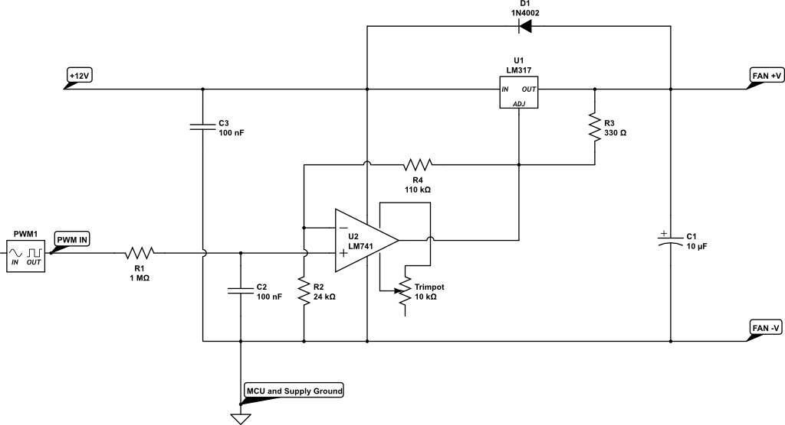
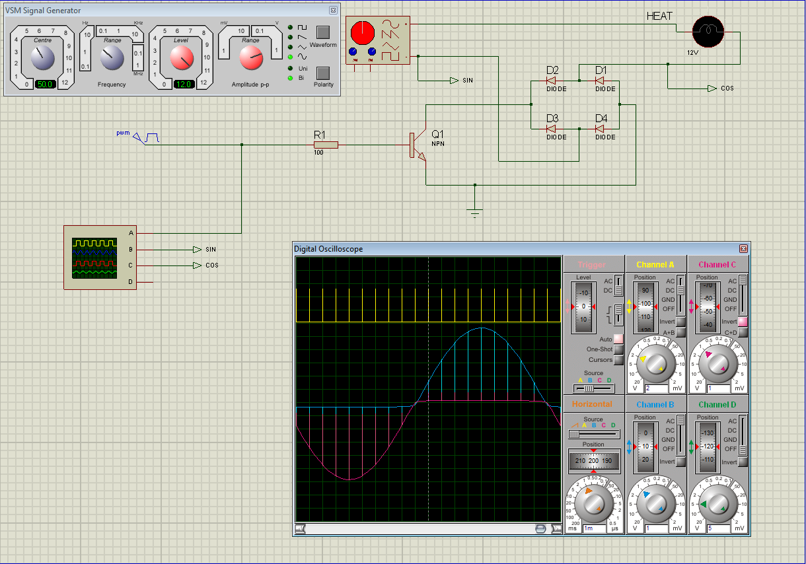
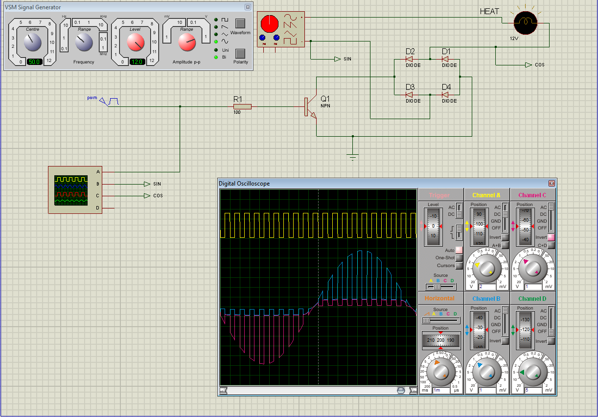
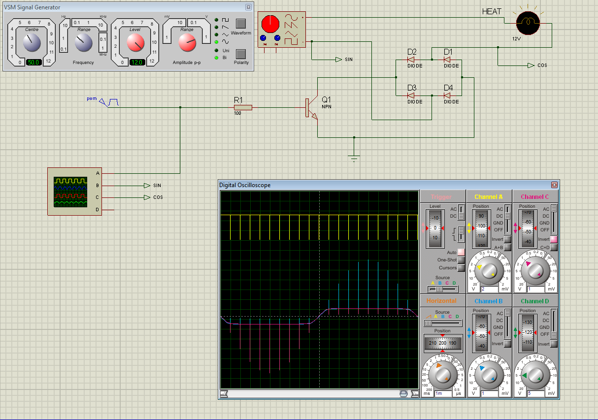

Page: `Setup -> Output`

For a complete list of supported output devices, see [Supported Output Devices](Supported-Outputs.md).

Outputs can generate a variety of signals that operate devices. Outputs can switch relays that operate at radio frequency using HIGH/LOW signals on GPIO pins, pulse-width modulation (PWM) signals, or 315/433 MHz signals; drive pumps and motors; execute Linux or Python commands; and more.

## Custom Outputs

AoT has a custom output import system that lets you create and use custom outputs within the AoT system. Custom outputs can be uploaded and imported on the `[gear icon] -> Configure -> Custom Outputs` page. Once imported, they can be used on the `Setup -> Output` page.

If you have developed a working module, consider [creating a new GitHub issue](https://github.com/AoT-inc/AoT/issues/new?assignees=&labels=&template=feature-request.md&title=New%20Module) or a pull request. The module may be included in the built-in set.

For examples of the proper format, you can open the built-in modules in the [AoT/aot/outputs](https://github.com/AoT-inc/AoT/tree/master/aot/outputs/) directory. Additionally, the [AoT/aot/outputs/examples](https://github.com/AoT-inc/AoT/tree/master/aot/outputs/examples) directory contains custom output examples.

For outputs that require a new measurement/unit, you can add them on the `[gear icon] -> Configure -> Measurements` page.

## Output Options

<table>
<thead>
<tr class="header">
<th>Setting</th>
<th>Description</th>
</tr>
</thead>
<tbody>
<tr>
<td>Pin (GPIO)</td>
<td>The GPIO pin to use for the output signal. Uses the BCM numbering scheme.</td>
</tr>
<tr>
<td>WiringPi Pin</td>
<td>The GPIO pin to use for the output signal. Uses the WiringPi numbering scheme.</td>
</tr>
<tr>
<td>On State</td>
<td>The GPIO signal state that turns the device on. HIGH sends a 3.3-volt signal, and LOW sends a 0-volt signal. If the output completes the circuit with a 3.3-volt signal to turn the device on, set this to HIGH. If a 0-volt signal turns the device on, set it to LOW.</td>
</tr>
<tr>
<td>Protocol</td>
<td>The protocol to use when transmitting over 315/433 MHz. The default is 1; if it does not work, try increasing the number.</td>
</tr>
<tr>
<td>UART Device</td>
<td>The UART device connected to the device.</td>
</tr>
<tr>
<td>Baud Rate</td>
<td>The baud rate of the UART device.</td>
</tr>
<tr>
<td>I2C Address</td>
<td>The I2C address of the device.</td>
</tr>
<tr>
<td>I2C Bus</td>
<td>The I2C bus the device is connected to.</td>
</tr>
<tr>
<td>Output Mode</td>
<td>The output mode, if supported.</td>
</tr>
<tr>
<td>Flow Rate</td>
<td>The flow rate (ml/min) for dispensing a volume.</td>
</tr>
<tr>
<td>Pulse Length</td>
<td>The pulse length to transmit over 315/433 MHz. The default is 189 ms.</td>
</tr>
<tr>
<td>Bit Length</td>
<td>The bit length to transmit over 315/433 MHz. The default is 24 bits.</td>
</tr>
<tr>
<td>Run as User</td>
<td>Selects the user under which the Linux command will run.</td>
</tr>
</tbody>
</table>
</tr>
<tr>
<tr>
<td>On Command</td>
<td>The command used to turn the output on. For a wireless relay, this is the numeric command to transmit; for a command output, this is the command to execute. The command may be run in a Linux terminal or in Python 3 (depending on the selected output type).</td>
</tr>
<tr>
<td>Off Command</td>
<td>The command used to turn the output off. For a wireless relay, this is the numeric command to transmit; for a command output, this is the command to execute. The command may be run in a Linux terminal or in Python 3 (depending on the selected output type).</td>
</tr>
<tr>
<td>Force Command</td>
<td>If the output is already on, enabling this option runs the on command instead of returning the message &quot;Output is already on.&quot;</td>
</tr>
<tr>
<td>PWM Command</td>
<td>The command used to set the duty cycle. The string &quot;((duty_cycle))&quot; within the command is replaced with the actual duty cycle before the command runs. For this to work correctly, the command must contain &quot;((duty_cycle))&quot;. The command may be run in a Linux terminal or in Python 3 (depending on the selected output type).</td>
</tr>
<tr>
<td>Current Draw (Amps)</td>
<td>The amount of current drawn by the device powered by the output. Note: this value should be calculated based on the voltage set in the Energy Usage settings.</td>
</tr>
<tr>
<td>Startup State</td>
<td>Specifies whether the output should be on or off when AoT first starts. Some outputs have additional options.</td>
</tr>
<tr>
<td>Startup Value</td>
<td>If the startup state is set to a user-defined value (for example, a PWM output), this value is set when AoT starts.</td>
</tr>
<tr>
<td>Shutdown State</td>
<td>Specifies whether the output should be on or off when AoT shuts down. Some outputs have additional options.</td>
</tr>
<tr>
<td>Shutdown Value</td>
<td>If the shutdown state is set to a user-defined value (for example, a PWM output), this value is set when AoT shuts down.</td>
</tr>
<tr>
<td>Trigger at Startup</td>
<td>Selects whether to trigger a Function (for example, an Output Trigger) if the startup state is set to on when AoT starts.</td>
</tr>
<tr>
<td>On for Duration (seconds)</td>
<td>A way to turn the output on for a specific duration. This can be useful for testing the output and its powered device(s), or the measured effect they have on environmental conditions.</td>
</tr>
</tr>
</tbody>
</table>

## On/Off (GPIO)

An On/Off (GPIO) output switches a GPIO pin to HIGH (3.3 volts) or LOW (0 volts). This is useful for controlling electromechanical switches such as relays to turn electrical devices on and off.

A relay is an electromechanical or solid-state device that uses a small voltage signal (for example, one generated by a microprocessor) to activate a much larger voltage, keeping the low-voltage system from being exposed to the danger of high voltage.

Add and configure outputs on the Output tab. An output must be configured correctly before it can be used elsewhere in the system.

To set up a wired relay, set the "GPIO Pin" (using the BCM numbering scheme) to the pin that will switch to HIGH (5 volts) and LOW (0 volts). This is used to activate relays and other devices. *On Trigger* must be set to the signal state (HIGH or LOW) that turns the device on. For example, if the relay is activated when the coil's potential is 0 volts, set *On Trigger* to "LOW". Conversely, if the relay is activated when the coil's potential is 5 volts, set it to "HIGH".

## Pulse-Width Modulation (PWM)

Pulse-width modulation (PWM) is a modulation technique that encodes a message into a pulsing signal at a specific frequency (Hz). The average value of the voltage (and current) supplied to the load is controlled by switching between the power source and the load at a rapid rate. The longer the switch is on compared to the time it is off, the higher the total power supplied to the load.

The PWM switching frequency must be much higher than the frequency that would affect the load (the device that uses the power). In other words, the resulting waveform perceived by the load should be as smooth as possible. The power supply switching rate can vary widely depending on the load and the application. For example:

!!! quote
    In an electric stove, switching must occur several times per minute; in a lamp dimmer, at 120 Hz; in motor drives, from a few kHz to tens of kHz; and in audio amplifiers and computer power supplies, up to tens or hundreds of kHz.

The duty cycle describes the ratio of the 'on' time to the regular interval or 'period' time. A low duty cycle means low power, because the power is off most of the time. Duty cycle is expressed as 0% for always off, 50% for off half the time and on half the time, and 100% for always on.

## Pulse-Width Modulation (PWM) Options

<table>
<thead>
<tr class="header">
<th>Setting</th>
<th>Description</th>
</tr>
</thead>
<tbody>
<tr>
<td>Library</td>
<td>Selects the method used to generate the PWM signal. Hardware pins can generate a PWM signal up to 30 MHz, while other (non-hardware PWM) pins can generate a PWM signal up to 40 kHz. See the table below for the hardware pins on the various Pi boards.</td>
</tr>
<tr>
<td>Pin (GPIO)</td>
<td>The GPIO pin to output the PWM signal on, using the BCM numbering scheme.</td>
</tr>
<tr>
<td>Frequency (Hertz)</td>
<td>The frequency of the PWM signal.</td>
</tr>
<tr>
<td>Invert Signal</td>
<td>Sends the inverted duty cycle to the output controller.</td>
</tr>
<tr>
<td>Duty Cycle</td>
<td>The ratio of on time to off time, expressed as a percentage (0-100).</td>
</tr>
</tbody>
</table>
### Non-Hardware PWM Pins

When using non-hardware PWM pins, only certain frequencies can be used. The allowed frequencies (Hz) are 40000, 20000, 10000, 8000, 5000, 4000, 2500, 2000, 1600, 1250, 1000, 800, 500, 400, 250, 200, 100, and 50 Hz. If you try to set a frequency not in this list, the nearest frequency is used instead.

### Hardware PWM Pins

When using hardware PWM pins, an exact frequency can be set. The same PWM channel can be used on multiple GPIOs. All GPIO pins that share the same PWM channel use the most recently set frequency and duty cycle.

<table>
<thead>
<tr class="header">
<th>BCM Pin</th>
<th>PWM Channel</th>
<th>Raspberry Pi Version</th>
</tr>
</thead>
<tbody>
<tr>
<td>12</td>
<td>0</td>
<td>All models except A and B</td>
</tr>
<tr>
<td>13</td>
<td>1</td>
<td>All models except A and B</td>
</tr>
<tr>
<td>18</td>
<td>0</td>
<td>All models</td>
</tr>
<tr>
<td>19</td>
<td>1</td>
<td>All models except A and B</td>
</tr>
<tr>
<td>40</td>
<td>0</td>
<td>Compute Module only</td>
</tr>
<tr>
<td>41</td>
<td>1</td>
<td>Compute Module only</td>
</tr>
<tr>
<td>45</td>
<td>1</td>
<td>Compute Module only</td>
</tr>
<tr>
<td>52</td>
<td>0</td>
<td>Compute Module only</td>
</tr>
<tr>
<td>53</td>
<td>1</td>
<td>Compute Module only</td>
</tr>
</tbody>
</table>

### Schematic for DC Fan Control

Below is a hardware schematic that lets you control a direct current (DC) fan using AoT's PWM output.

Controlling a 12-volt DC fan (for example, a PC fan) with a PWM output



### Schematic for Alternating Current (AC) Modulation

Below is a hardware schematic that lets you modulate alternating current (AC) using AoT's PWM output.

Modulating alternating current (AC) at a 1% duty cycle with a PWM output



Modulating alternating current (AC) at a 50% duty cycle with a PWM output



Modulating alternating current (AC) at a 99% duty cycle with a PWM output



## Peristaltic Pump

AoT supports two peristaltic pump output modules: the Generic Peristaltic Pump Output and the Atlas Scientific EZO-PMP Peristaltic Pump.

### Generic Peristaltic Pump

You can use the Generic Peristaltic Pump Output to dispense liquid with any peristaltic pump. The most basic dispensing functions are to start dispensing, stop dispensing, or dispense for a set amount of time. If the pump speed has been measured, entering this value in the "Fastest Rate (ml/min)" setting allows the output controller to dispense a specific volume rather than simply a duration. To dispense a specific volume, you must set the output mode and specify the "Desired Flow Rate (ml/min)".

To measure the pump's flow rate, first remove all air from the pump tubing. Then instruct the pump to dispense for 60 seconds and collect the dispensed liquid. When finished, measure the amount of dispensed liquid in milliliters and enter it in the "Fastest Rate (ml/min)" setting. Once the pump's flow rate is set, you can now dispense a specific volume.

This output module works by switching a GPIO pin to HIGH or LOW to turn the peristaltic pump on and off. This is most easily implemented by using a relay in series with the pump's power supply, or by using the GPIO directly as the pump's input signal (if supported). When using a relay, it is important to design a circuit that enables the pump to switch quickly. Because the volume a pump dispenses depends on time, the faster the pump can be switched, the higher the dispensing accuracy. Many peristaltic pumps operate on DC voltage and require an AC-to-DC converter. These converters can take time to energize or de-energize as power is applied or removed, which can affect dispensing accuracy. To address this, you should switch DC power rather than AC power to eliminate these potential delays.

### Atlas Scientific Peristaltic Pump

The Atlas Scientific Peristaltic Pump is a device that combines a peristaltic pump with a microcontroller, capable of precisely dispensing a specific volume of liquid via I2C or serial communication. This pump can accept [several commands](https://www.atlas-scientific.com/files/EZO_PMP_Datasheet.pdf), including commands to calibrate, turn on, turn off, and dispense at a specific rate. The Atlas Scientific Peristaltic Pump is a good option, but it costs more than a generic peristaltic pump.

### Peristaltic Pump Options

<table>
<thead>
<tr class="header">
<th>Setting</th>
<th>Description</th>
</tr>
</thead>
<tbody>
<tr>
<td>Output Mode</td>
<td>&quot;Fastest Rate&quot; dispenses liquid at the fastest possible rate. &quot;Specify Flow Rate&quot; dispenses liquid at the rate set in the &quot;Flow Rate (ml/min)&quot; option.</td>
</tr>
<tr>
<td>Flow Rate (ml/min)</td>
<td>The rate at which liquid is dispensed when &quot;Specify Flow Rate&quot; is selected in the &quot;Output Mode&quot; option.</td>
</tr>
<tr>
<td>Fastest Rate (ml/min)</td>
<td>The rate (ml/min) at which the pump dispenses liquid.</td>
</tr>
<tr>
<td>Minimum On Time (sec/min)</td>
<td>The minimum duration (in seconds) the pump must be on during each 60-second period. This option is only used when &quot;Specify Flow Rate&quot; is selected in the &quot;Output Mode&quot;.</td>
</tr>
</tbody>
</table>

## Wireless 315/433 MHz

Some 315/433 MHz wireless relays can be used. You must configure the transmitter's pin (using the BCM numbering scheme), pulse length, bit length, protocol, on command, and off command. To determine the on and off commands, connect a 315/433 MHz receiver to the Pi, then run the script below, replacing 17 with the pin the receiver is connected to (using the BCM numbering scheme). Press a button on the remote (on or off) to detect the numeric code associated with that button.

```bash
sudo /opt/AoT/env/bin/python /opt/AoT/aot/devices/wireless_rpi_rf.py -d 2 -g 17
```

433 MHz wireless relays have been successfully tested with the SMAKN 433MHz RF transmitter/receiver and Etekcity Wireless Remote Control Electrical Outlets (see [Issue 88](https://github.com/AoT-inc/AoT/issues/88)). If you have a 315/433 MHz transmitter/receiver and wireless relay that do not work with the current code, submit a [new issue](https://github.com/AoT-inc/AoT/issues/new) including your hardware details.

## Linux Command

This option runs a terminal command when the output is turned on, turned off, or the duty cycle is set. Commands are run as the 'root' user. When you create a Linux Command output, example code is provided showing how to use the output.

## Python Command

The Python Command output works similarly to the Linux Command output, but runs Python 3 code. When you create a Python Command output, example code is provided showing how to use the output.

## Output Notes

Wireless and command (Linux/Python) outputs: because the wireless protocol only allows one-way communication with 315/433 MHz devices, a wireless relay is assumed to be off until it is turned on, and is displayed in red (off) when added. If a wireless relay is turned on or off outside of AoT (for example, with a remote), AoT cannot verify the relay's state and displays its last known state. For example, if AoT turns a wireless relay on and you turn the relay off with the remote, AoT still assumes the relay is on.
