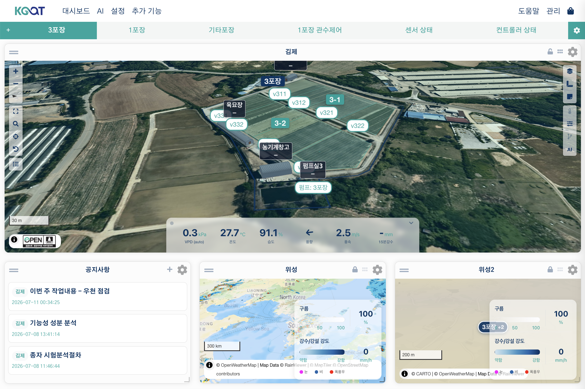

# AoT_map 위젯

`AoT_map`은 여러 동·구역에 흩어진 센서와 장치를 지도 한 장 위에서 보고 바로 제어하는 대시보드 위젯입니다. 예를 들어 온실 5동에 관수 밸브 20개, 온습도 센서 10개가 설치되어 있다면, 이 위젯 하나로 전체 배치를 한눈에 보고, 색이 다른 장치를 클릭해 바로 켜고 끄고, 각 지점의 최근 측정값과 AI 조언까지 확인할 수 있습니다. MapLibre GL 기반이라 3D 지형·시설 렌더링과 부드러운 확대/축소를 지원합니다.

---

## 위젯 추가하기 { #adding-the-widget }

1. 대시보드에서 **위젯 추가 → AoT 지도**를 선택합니다.
2. 설정에서 표시할 지도를 선택합니다(비워두면 가장 최근에 수정한 지도를 사용).
3. **저장**을 클릭합니다.

---

## 주요 기능

### 장치 마커 { #device-markers }

`/geo/design`에서 **장치(Device)** 모드로 배치한 입력·출력·함수 장치가 지도 위에 마커로 표시됩니다.

- **마커 색상**: 장치의 활성/비활성/오류 상태에 따라 자동으로 바뀝니다.
- **마커 겹침 정리**: 확대 수준이 낮아 마커가 겹치면 개수 배지가 있는 그룹으로 합쳐 표시하고, 확대하면 다시 개별 마커로 펼쳐집니다.
- **장치 아이콘**: 장치 종류(온도 센서·릴레이·펌프 등)에 따라 다른 아이콘을 사용합니다.

### 팝업으로 바로 제어하기 { #control-right-from-the-popup }

마커를 클릭하면 장치 종류에 맞는 창이 열립니다.

**입력(센서)** — 값 키를 클릭하면 상세 창이 열립니다. 최근 24시간 그래프와
측정 항목별 현재값이 함께 나오며, 노트도 바로 작성할 수 있습니다. 이 창은
시설·구역 모달에서 센서를 열었을 때와 **같은 창**입니다.

**출력·함수** — 구역·시설과 같은 중앙 창이 열리며, 위에서부터 세 덩이입니다.

1. **제어** — 장치 이름과 On/Off 토글(**편집 권한**이 있는 사용자에게만 표시),
   그 아래에 작동 시간과 다음 예약, on/off 출력이면 **설정** 버튼까지.
   창을 여는 목적이 대개 지금 조작하는 것이라 이 덩이가 맨 위입니다.
2. **이력** — 최근 가동 기록 그래프. 그 판단을 뒷받침하는 자리입니다.
3. **노트**

작동 시간은 **한 칸이 두 상태를 번갈아** 씁니다. 꺼져 있으면 마지막으로 작동한
시간(흐린 글씨), 켜는 순간 그 자리가 곧바로 흐르는 타이머로 바뀝니다(진한 글씨).
다른 창이나 예약으로 켜고 꺼도 이 창이 열려 있는 동안 계속 따라옵니다.

개폐율 장치(창문·커튼 등)는 토글 대신 닫기/정지/열기 버튼이 나오고, PWM 출력은 현재 퍼센트와 0~100% 슬라이더가 나옵니다. 둘 다 **설정** 버튼은 없습니다.

복합장치는 자기가 돌아가는 장치가 아니라, 창이 **구성**으로 열립니다 — 안에 든 센서·장치 목록이며 이력은 없습니다. 줄을 누르면 그 장치의 창으로 내려갑니다.

시설(Facility) 마커를 클릭하면 3D 미리보기와 환경 데이터 요약을 볼 수 있습니다 — 자세한 내용은 [3D 시설 팝업](#3d-facility-popup)을 참고하세요.

### 구역/대지 클릭 — 장치 목록으로 제어 { #click-a-zonesite-control-from-a-device-list }

구역(Zone)이나 대지(Site) 도형을 클릭하면, 그 안에 배치된 센서·출력 장치를 한 번에 보는 팝업이 열립니다.

- **센서**: 여러 개면 탭으로 전환하며 최근 24시간 차트를 볼 수 있습니다.
- **출력 장치 목록**: On/Off 토글로 즉시 제어(**편집 권한** 필요), 드래그로 순서 변경.
  작동 시간은 장치 창과 같은 규칙으로 표시되고(꺼짐=마지막 작동 / 켜짐=흐르는 타이머), 그 옆에 다음 예약이 함께 나옵니다.
  장치 이름을 클릭하면 위 그래프 자리에 그 장치의 가동 이력이 그려집니다.
- **함께 영향받는 것**: 토글 바로 아래에, 그 장치가 다른 구획까지 덮으면 그 이름을 적습니다 — 켜기 전에 무엇이 함께 움직이는지 읽을 수 있습니다.
- **함수**: 그 안의 함수를 장치 목록 아래에 종류와 함께 늘어놓고, On/Off 스위치로 켜고 끕니다. 복합장치는 이름을 누르면 그 장치의 창으로 내려갑니다.
- **설정(예약 켜기)**: 출력마다 있는 **설정** 버튼 — 아래 [예약 켜기](#scheduled-on) 참고.

드래그로 정한 순서는 **구역**의 속성이라, 그 구역을 여는 모든 사람이 같은 순서를 봅니다. 대지 창에는 저장되는 순서가 없습니다.

### 구획 클릭 — 무엇이 있나 { #plot }

디자인 도구의 [구획 모드](design-tool.ko.md#plot)에서 그린 구획을 지도에 표시하고, 클릭하면 그 운영 정보를 봅니다. 창에는 **현황 / 환경·제어 / 설정** 세 탭이 있습니다.

- **[현황] > 자원** — 두 층입니다. 위는 지금 단계가 요구한다고 선언한 것이고, 아래는 이 구획에 닿는 관수 장치가 **오늘**과 **최근 7일** 동안 얼마나 돌았고 물이 얼마나 나갔는지(추정)이며, 물량이 나오는 장치가 둘 이상이면 **합계** 줄이 붙습니다. 물량은 설계 유량(시설의 배관 도면 · 노지 지도의 토출구) × 가동시간 × 구획 몫이라 **유량계 실측이 아닙니다**. 그 기간에 작동 기록이 없는 장치는 0 대신 "기록 없음"으로 적습니다. 물량을 낼 수 없는 장치는 아예 줄로 내지 않고, 표 **아래 안내**가 그 이름과 이유를 말합니다 — 이 구획 안에 그려진 토출구가 없거나, 유량을 모르거나 둘 중 하나입니다. 같은 안내가 표 전체에 대해 추정이라는 것과 구획 몫이 얼마인지도 한 번만 말합니다. 이 구획에 걸친 영역에 아직 장치가 배정되지 않았으면 **[현황]**이 그 사실도 알립니다 — 손댈 수단이 없다는 뜻이지 목록에 올릴 장치가 아닙니다. 같은 값을 기간별로 자세히 보려면 [일지](journal.ko.md)를 쓰세요.
- **[현황]** — **단계** 카드에 현재 단계와 경과 일수, 적산온도, 지금 단계의 지침이 나옵니다. 그 아래 **환경** 카드에는 프로그램·센서가 뒷받침하면 **적산온도(GDD)**(작기 시작부터의 누적치, [일지 참고](journal.ko.md#gdd))와 **DLI**(오늘 값 대 목표, [일지 참고](journal.ko.md#dli))도 함께 뜹니다. 둘 중 하나라도 계산할 수 없으면 그냥 비는 대신 사유(프로그램 없음·기준온도 없음·자료 부족)를 말합니다.
- **[현황] > 단계 전환** — 계산상 다음 단계에 들어섰으면 여기서 전환을 **확인**하거나 **연기**합니다. 확인된 전환의 기록(**단계 기록**)과 **마지막 되돌리기**는 **[설정] > 프로그램**에 있습니다. 단계별 목표는 **환경** 카드의 현재값 옆에 함께 표시됩니다. [관리 프로그램](programs.ko.md#stage-events)을 참고하세요.
- **[설정] > 단계 일정** — 실제 일정을 고치는 곳입니다. 프로그램 기간은 참고일 뿐이라 단계를 **연기하거나 앞당길** 수 있고, 이 구획만 자동 전환으로 둘 수도 있습니다. [단계 일정 고치기](programs.ko.md#stage-schedule)를 참고하세요.

!!! 참고 "목표는 여기서 읽기 전용입니다"
    이 팝업은 각 단계의 목표를 보여주기만 하고 고치지는 않습니다 — [구획 자신의 목표 override](programs.ko.md#plot-override)는 [`/plots` 페이지](programs.ko.md#plots-page)나 [AoT 구획 위젯](plot-widget.ko.md)에서 하며, 지도에서는 할 수 없습니다.

- **[설정] > 구획 정보** — 면적과 치수. 가로·세로를 함께 보여줍니다. 면적만으로는 "몇 줄 심을 수 있나"에 답할 수 없기 때문입니다.
- **[설정] > 기본 정보** — 대상·품종·구획 이름·시작일·예상 종료일. **편집**으로 고칠 수 있습니다.
- **[환경·제어]의 제어 목록** — 이 구획과 영역이 겹치는 장치를 많이 겹치는 순서로 보여주고, 각각 이 구획을 얼마나 덮는지, 다른 구획까지 덮으면 그 이름도 함께 적습니다. 영역 하나가 여러 작물에 걸치고 한 작물이 두 영역에 걸치기도 하므로, 장치를 하나로 정하지 않고 겹치는 면적을 그대로 보여줍니다. 비율은 **구획 면적 대비**입니다("내 두둑이 얼마나 덮이는가"). 그 장치가 실제로 무엇을 하는지는 시스템이 모릅니다 — 아는 것은 두 영역이 겹친다는 것뿐이라, 화면은 "적신다"가 아니라 "덮는다"로 적습니다.
- **[환경·제어]의 센서** — 구획 안의 센서를 보여줍니다. 없거나, 있어도 값을 주지 않으면 상위 구역에서 가장 가까운 센서를 빌려 오고 거리를 꼬리표로 답니다. 꼬리표에 마우스를 올리면 둘 중 어느 쪽인지 나옵니다. 값을 주지 않는 구획 안 센서는 사라지지 않고 **값 없음** 꼬리표를 단 채 목록에 남으며, 값을 주는 센서가 앞에 옵니다 — 열자마자 빈 차트를 보지 않게 하기 위함입니다.
- **[현황] > 노트** — 다른 도형과 같은 공용 노트 블록입니다.

!!! 참고 "작물별 요구량은 배분하지 않습니다"
    겹친 영역에서 물은 물리적으로 공유되므로 작물별 **요구량**을 더하면 틀린 숫자가 나옵니다. 근거만 보여주고 판단은 사람이 합니다. (실제로 **나간** 물의 추정치는 다른 이야기이고, 위 **[현황] > 자원**에 있습니다.)

구획 라벨(칩)은 다른 라벨과 같이 **축소 시 라벨 숨기기 L1** 기준(기본 17)보다 확대했을 때 나타납니다 — 라벨이 이미 많은 화면이라 항상 띄우면 겹칩니다. 구획 도형은 레이어 컨트롤이나 설정의 **구획 도형** 옵션으로 끄고 켤 수 있으며 두 곳은 같은 값을 공유합니다. 구획 라벨은 **레이어 → 라벨**에서 따로 끕니다.

### 대표 측정 정하기 { #representative-measurement }

구역·시설 창의 **[현황] → 환경** 카드에는 그 안의 센서 값이 나란히 표시됩니다.
여기서 **값을 클릭하면 그 측정이 대표가 되고**, 배경이 칠해져 어느 것이 대표인지
남습니다. 다시 누르면 지정이 풀립니다(**편집 권한** 필요).

지정한 대표 측정은 다음 세 곳이 함께 씁니다.

- 지도 위의 **시설 칩**에 뜨는 값
- **대지** 창의 구역·시설 줄에 뜨는 값
- 그 창의 환경 카드(배경 표시)

지정하지 않으면 VPD > 온도 > 습도 > CO₂ > 조도 > 풍속 순으로 자동 선택됩니다.
지정은 **구역·시설마다 따로** 저장되므로, 육묘장은 온도·노지는 토양수분처럼
자리마다 다르게 둘 수 있습니다. 지정한 센서가 값을 내지 못하는 동안에는 자동
선택으로 잠시 물러났다가, 센서가 돌아오면 지정이 그대로 살아납니다.

### 예약 켜기 { #scheduled-on }

on/off 출력 장치의 **설정** 버튼을 누르면 시작 시각과 작동 시간을 지정하는 창이 열립니다.
구역 모달 · 시설 모달 · 장치 마커 팝업 어디서 열어도 같은 창입니다.

- 작동 시간을 `00:00`으로 두면 수동으로 끌 때까지 계속 켜져 있습니다.
- 시작 시각이 사실상 "지금"이면 즉시 켜고, 작동 시간이 끝나면 자동으로 끕니다.
- 시작 시각이 오늘 이미 지난 시각이면 그 자리에서 켜지 않고 **내일 같은 시각**으로 밀립니다.
- 시작 시각이 미래면 **서버 스케줄러에 등록**됩니다. 브라우저를 닫아도 예정대로
  실행되며, [작업 예약](../ai/scheduler.md) 페이지에서 확인·수정·취소할 수 있습니다.
- 서버 등록에 실패하면(예: 그 장치에 대한 권한이 없음) 현재 탭이 대기했다가 실행하는
  방식으로 대신 진행할지 물어봅니다. 이 경우에만 탭을 닫으면 실행되지 않습니다.

두 휠 아래에는 고른 값이 무엇을 뜻하는지 한 줄로 나옵니다 — 언제 켜지고, 언제 꺼지고, 얼마나 도는지. 그 구간이 이 장치에 이미 걸린 예약과 겹치면 그 사실과 함께 **실제로 꺼지는 시각**을 적습니다. 먼저 끝나는 타이머에 함께 꺼지기 때문입니다. 그 아래에는 이 장치에 걸려 있는 예약이 나열되어 하나씩 취소할 수 있고, 저장한 뒤에도 창은 그대로 남습니다.

개방률을 다루는 장치(창문·커튼 등)에는 이 버튼이 없습니다 — "언제부터 언제까지 켬"이라는
의미가 성립하지 않기 때문입니다.

### 실시간 갱신

위젯은 설정된 주기(기본 5초)마다 장치 상태를 자동으로 새로고침합니다. 마커 색상과 측정값 라벨이 실시간으로 업데이트되며, 팝업이 열려 있어도 값이 계속 갱신됩니다.

### 지도 위 도구 버튼

지도 좌측 또는 우측 모서리에 다음 도구 버튼이 표시됩니다.

| 버튼 | 기능 |
| :--- | :--- |
| +/- | 확대/축소 |
| 전체화면 | 위젯을 전체화면으로 표시 |
| 검색 | 주소 검색 후 해당 위치로 이동 |
| 내 위치 | 브라우저 GPS 위치로 이동 |
| 초기화 | 처음 저장된 위치·확대 수준으로 되돌리기 |
| 대지 목록 | 등록된 대지·구역 목록에서 선택해 바로 이동 |
| 저작권(ⓘ) | 현재 표시 중인 배경/오버레이 지도의 출처 표기를 보여줍니다. 지도를 처음 열거나 배경·오버레이를 바꿀 때 자동으로 펼쳐지고, 지도를 직접 조작하면(드래그·확대·터치) 접힙니다. |

이 외에 위젯 제목 표시줄에는 **지도 잠금**(이동·확대 잠금)과 **컨트롤 숨기기**(도구 버튼 숨기기) 아이콘이 있습니다. 이 둘은 설정 화면이 아니라 위젯 제목 표시줄에서 바로 켜고 끄는 토글입니다.

---

## 설정 옵션 { #widget-settings }

설정 창의 구성 순서와 같습니다. 접힘 항목(데이터 전송 주기 · 장치 필터 · 측정값 패널 ·
라벨 스타일 · 도형 · 3D 지도)은 눌러서 펼칩니다.

### 지도 { #map }

| 옵션 | 설명 |
| :--- | :--- |
| 지도 선택 | 표시할 저장된 지도를 선택합니다. 비워두면 가장 최근에 수정한 지도를 사용합니다. |
| 라벨 표시 | 대지·구역·시설·장치·센서 라벨 전체를 켜고 끄는 마스터 스위치입니다. 종류별 세부 표시는 지도 우측 도구의 **레이어 → 라벨**에서 따로 조정합니다. |
| 데이터값만 표시 (지도 숨김) | 지도 배경과 오버레이를 감추고 옆의 측정값 패널만 보여줍니다. |
| AI 권고 | 이 지도가 속한 시설·대지에 대한 최신 AI 조언 요약을 지도 상단에 클릭 가능한 칩으로 표시합니다(전역 AI가 설정되어 있어야 합니다). |
| 현지 시각 표시 | 지도 상단 가운데에 **지도 중심이 있는 곳**의 시각을 세 칸으로 띄웁니다 — 가운데가 현재 시각, 왼쪽이 직전 사건, 오른쪽이 다음 사건입니다. 그래서 낮에는 `일출 · 지금 · 일몰`, 밤에는 `일몰 · 지금 · 내일 일출`로 보입니다. 지도를 옮기면 그 위치의 시간대로 다시 계산합니다. 지도의 현지 날짜가 브라우저의 날짜와 다르면 시계 칸에 그 날짜도 함께 적고, 마우스를 올리면 시간대 이름이 나옵니다(그 위치의 시간대를 찾지 못했으면 농장 시간대를 쓰고 있다고 알립니다). 해가 뜨거나 지지 않는 곳에서는 사건 대신 **백야**·**극야**를 적은 칸이 하나 더 나옵니다. 왼쪽 아래 작은 원 위에서 휠을 굴리면(폰은 세로로 끌면) 시계 크기가 바뀌고, 그 크기는 위젯에 저장됩니다. 켜져 있는 동안 주소 검색바와 AI 조언 칩은 그 아래로 내려갑니다. |

!!! 참고
    **지도 선택**을 다른 지도로 바꾸면 위치·확대 수준이 자동으로 초기화됩니다(새 지도 기준으로 다시 맞추기 위함).

### 데이터 전송 주기

| 옵션 | 설명 |
| :--- | :--- |
| 위젯의 갱신 주기 (초) | 위젯을 다시 불러오는 간격. **0으로 두면 자동 새로고침을 끕니다.** (기본 5초) |
| 입력 값 갱신 주기 (초) | 측정값 패널의 입력 측정값을 새로 고치는 간격. (기본 300초) |
| 출력 상태 갱신 주기 (초) | 지도 위 출력의 On/Off 상태를 새로 고치는 간격. (기본 5초) |

### 장치 필터 { #device-filter }

| 옵션 | 설명 |
| :--- | :--- |
| 입력 / 출력 / 함수 | 지도에서 **숨길** 장치를 종류별로 선택합니다(제외 목록). 아무것도 선택하지 않으면 `/geo/design`에 배치된 모든 장치가 표시됩니다 — 특정 장치만 지도에서 감추고 싶을 때만 사용하세요. |

### 측정값 패널 { #measurement-panel }

| 옵션 | 설명 |
| :--- | :--- |
| 측정값 패널 표시 | 측정값 패널을 띄웁니다. 끄면 아래에서 측정값을 골라 두었어도 패널 전체를 숨깁니다(고른 항목은 그대로 남아 다시 켜면 돌아옵니다). |
| 입력 / 출력 / 함수 | 지도 옆 데이터 패널에 표시할 측정값을 종류별로 선택합니다. |

고르는 즉시 저장되고, 페이지를 새로 고치지 않아도 패널이 새 선택으로 다시 그려집니다.

### 라벨 스타일

이름 라벨(대지·구역·시설)과 측정값 키(입력 센서 값)에 **모두** 적용됩니다.
표시 여부 자체는 위 **라벨 표시** 마스터 스위치를 따릅니다.

| 옵션 | 기본값 | 설명 |
| :--- | :--- | :--- |
| 라벨 충돌 방지 | 켜짐 | 켜면 겹치는 라벨을 자동으로 묶습니다. 이때 **구체적인 대상이 남습니다** — 함수 > 입력 > 출력 > 장비 > 시설 > 구역 > 대지 순으로 자리를 잡고, 밀려난 라벨은 `이름 +N` 배지로 표시되어 조용히 사라지지 않습니다. |
| 레이블 글자 크기 | 1.0 | 지도의 모든 라벨과 측정값 키의 글자 크기(em). 1.0~3.0. |
| 축소 시 라벨 숨기기 L1 | 17 | 이 확대 수준보다 축소하면 출력·입력·함수·장비·센서·구획·동·노트 라벨과 값 키를 숨깁니다. 대지 라벨은 위치를 가늠할 수 있도록 항상 표시됩니다. 구역·시설 라벨은 아래의 더 넓은 L2 기준을 따릅니다. **0으로 두면 숨기지 않습니다.** |
| 축소 시 라벨·도형 숨기기 L2 | 15.5 | L1보다 넓은 화면에서도 읽혀야 하는 것들을 위한 별도 기준입니다 — **구역·시설 라벨**과 **구역·구획·장비 도형**. 대지 도형과 장치 마커는 확대 수준으로 접히지 않습니다. 작동 중인 출력은 숨겨진 상태에서도 라벨과 도형이 보이지만, 이 확대 수준보다 축소하면 그 창이 열려 있지 않은 한 함께 접힙니다. **0으로 두면 숨기지 않습니다.** |
| 시설 중심 라벨 | 꺼짐 | 꺼짐(기본값)은 야외 중심, 켜짐은 시설 중심으로 라벨의 줌 단계별 노출 규칙을 바꿉니다. 쌓임 순서(어느 라벨이 위로 오는지)는 이 값과 무관하게 항상 대지 > 구역 > 시설 > 장비 > 출력 > 입력 > 함수입니다. |
| 센서 마커 스타일 | 원형 (정수 값) | **원형 (정수 값)**(대표 측정값을 정수로 표시, 측정 구간 색상 적용) 또는 **텍스트 라벨**(값과 단위를 함께 표시). |
| 센서 팝업 사용 | 켜짐 | 켜면 값 키를 클릭했을 때 최근 24시간 그래프가 있는 상세 창이 열립니다. |
| 팝업 기본 탭 | 현황 | 구역·시설·구획 창을 열 때 처음 보일 탭(**현황** / **환경·제어** / **개요**). 장치 창에는 탭이 없습니다. |

!!! 참고
    마우스를 올리거나 클릭한 라벨은 종류와 무관하게 항상 맨 앞으로 올라옵니다.
    클릭으로 연 라벨은 그 창이 닫힐 때까지 앞에 고정됩니다.

### 도형

디자인 도구에서 그린 폴리곤을 지도 위에 반투명 오버레이로 표시할지 종류별로 켜고 끕니다.

| 옵션 | 설명 |
| :--- | :--- |
| 대지 도형 | 대지 경계선(설정된 테마 색상). |
| 구역 도형 | 구역 경계선. |
| 구획 도형 | 구획(어디에 무엇이 있는가). 구획 라벨은 **축소 시 라벨 숨기기 L1** 기준을 따릅니다. |
| 시설 도형 | 건물 외곽선. |
| 설비 도형 | 배관 등 장비의 도형. |
| 장치 도형 | 장치가 차지하는 영역 도형. |
| 기타 그리기 도형 | 그리기 도구로 만든 자유 도형. |
| 장치 도형 투명도 | 위 장치 도형의 불투명도(0~100). 0은 투명, 100은 완전 불투명. |

### 3D 지도(벡터 모드) { #3d-map-vector-mode }

| 옵션 | 설명 |
| :--- | :--- |
| 3D 지형 사용 | 고도에 따른 3D 지형(힐셰이드) 렌더링을 켭니다. 이 줄은 설치본에 들어 있는 지도 엔진이 지형을 그릴 수 있을 때만 나타납니다. 지금 들어 있는 버전은 그리지 못하므로 이 줄이 보이지 않고, 예전에 저장해 둔 값도 적용되지 않습니다. |
| 시설 렌더 모드 | 시설(건물) 3D 모델을 그리는 방식: **기본 (반투명)** / **단색 (불투명)** / **와이어프레임** / **성능 (모바일)**(모바일용, 부하 최소화). |
| 벡터 스타일 URL | 커스텀 MapLibre 스타일 JSON을 쓰고 싶을 때만 입력합니다. 비워두면 GIS 입력 설정을 따릅니다. |

### 자동으로 저장되는 값 { #values-saved-automatically }

아래는 설정 창에 없는, **지도를 조작하면 알아서 기억되는 값**입니다. 직접 입력하지 않습니다.

| 값 | 언제 저장되나 |
| :--- | :--- |
| 위치·확대 수준·피치·베어링 | 지도를 이동·확대·기울일 때 |
| 활성 오버레이 레이어 / 선택된 기본 지도 | 지도의 레이어 선택기를 조작할 때 |
| 라벨 종류별 표시 여부 | 도구 막대의 라벨 버튼이나 **레이어 → 라벨** 체크박스를 누를 때 |
| 도형 종류별 표시 여부 | **레이어**의 도형 체크박스를 누를 때 — 설정 창의 **도형**과 같은 값입니다 |
| 지도 잠금 / 컨트롤 숨김 | 해당 도구 버튼을 누를 때 |
| 현지 시각 시계 크기·접힘 여부 | 시계 크기를 바꾸거나 접을 때 |
| 측정값 패널 분할 비율·접힘 여부 | 패널 경계를 끌거나 접을 때 |
| AI 조언 칩 숨김 | 도구 막대의 **AI** 버튼을 누를 때 |

---

## 범례(Legend)

지도 우측 하단에 범례가 자동으로 표시됩니다. 별도 설정 없이 현재 켜져 있는 오버레이 레이어의 색상과 입력/출력 장치 아이콘을 설명하며, 범례 항목을 클릭하면 해당 레이어·장치 표시를 켜고 끌 수 있습니다.

---

## 3D 시설 팝업 { #3d-facility-popup }

시설(Facility) 마커나 폴리곤을 클릭하면 간단한 3D 미리보기와 환경 데이터 요약이 팝업으로 표시됩니다. **[현황]** 탭의 환경 카드에는 [구획과 마찬가지로](#plot) 적산온도(GDD)·DLI도 함께 뜹니다 — 특정 동이 아니라 시설 전체 기준입니다. 시설에 구획이 둘 이상이면 이 두 값은 전부를 합한 값이 아니라 첫 번째 구획을 따릅니다. 같은 탭에는 마지막 관수와 곧 닥칠 기상 위험도 함께 나오며, 노지와 같은 예보를 씁니다. 전체 화면으로 자세히 보려면 [AoT_facility 위젯](facility-widget.md)을 사용하세요.

---

## 대지 기상대 지정 { #site-weather }

대지 창의 **[개요]** 탭에는 **기상대** 항목이 있습니다. 일사량·강우량은 대지 전체에 하나 있는 기상대가 재는 값이므로, 그 대지 안 구획·구역이 이 값을 빌려 쓸 때 어느 장치를 기준으로 삼을지 여기서 정합니다([일지](journal.ko.md#dli), [주야 목표](journal.ko.md#daylight) 참고).

- **아무것도 지정하지 않으면** 각 장치가 재는 측정값 이름으로 AoT가 자동으로 추론합니다 — 아무도 손대지 않은 설치에서 값이 나오게 하는 안전망일 뿐 정답은 아닙니다. 일사계가 둘이거나 실험용 센서가 섞여 있으면 어느 쪽이 맞는지 이 설정 없이는 바로잡을 수 없습니다.
- **하나 이상 체크**하면 그 장치로 명시적으로 지정되고, 이후 자동 추론보다 우선합니다.
- **전부 해제하는 것은 "끄기"가 아니라 "지정 안 함"**입니다. 자동 추론으로 돌아갈 뿐, 기상 값 자체가 안 나오게 되지는 않습니다.

목록의 각 줄에는 장치 이름과, 그 아래에 그 장치가 재는 항목이 함께 적힙니다. 장치가 많은 대지에서는 이 둘째 줄이 두 장치를 가르는 유일한 단서인 경우가 많습니다. 무언가를 켜고 끄기만 하는 장치는 목록에서 빠지고, AoT가 스스로 찾은 것이 먼저 나옵니다. 목록 위의 한 줄은 지금 어느 규칙이 쓰이고 있는지 — 여기서 지정했는지, 자동으로 찾았는지, 아무것도 못 찾았는지 — 를 말합니다. 고른 내용은 **[적용]**을 눌러야 저장되며, 편집 권한이 없으면 목록은 읽기 전용입니다.

---

---

## 여러 지도를 한 대시보드에

같은 대시보드에 `AoT_map` 위젯을 여러 개 추가하고 각각 다른 지도를 표시할 수 있습니다. 예를 들어 전체 대지를 보여주는 개요용 지도와, 특정 동만 확대한 지도를 나란히 배치할 수 있습니다.

---

## 관련 페이지

- [디자인 도구](design-tool.md) — 장치·도형 배치
- [시설 위젯](facility-widget.md) — 3D 시설 전용 위젯
- [GIS 레이어](layers.md) — 오버레이 레이어 등록
- [일지](journal.ko.md) — 같은 GDD·DLI·관수량 자료로 만드는 스냅샷 문서
- [AoT 구획 위젯](plot-widget.ko.md) — 구획 하나를 계속 보는 대시보드 위젯, 이 팝업엔 없는 목표 편집 기능이 있습니다
