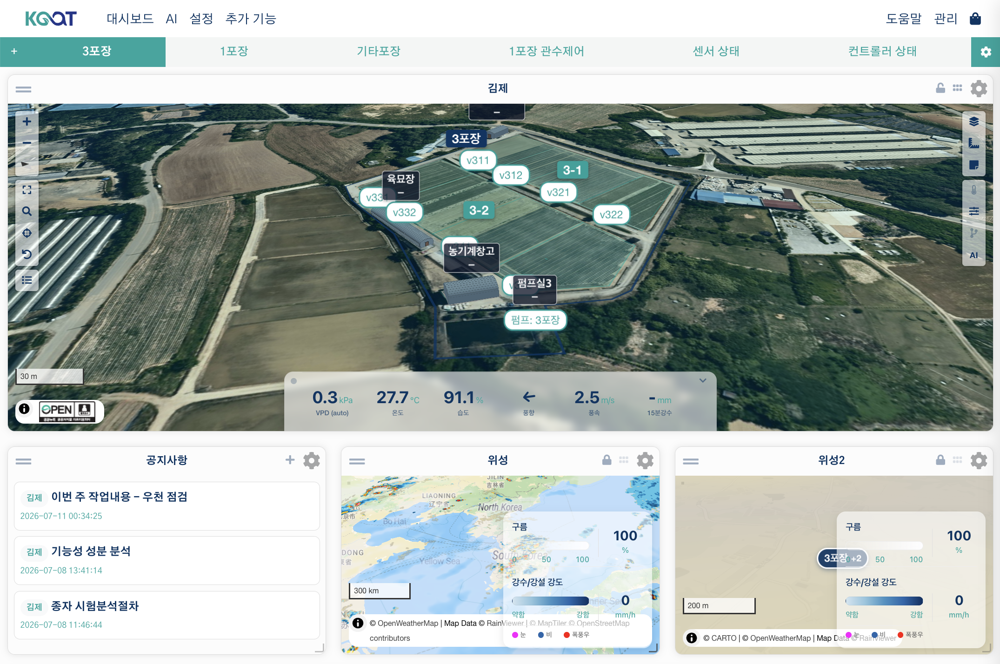

# AoT_map Widget

`AoT_map` is a dashboard widget that shows the sensors and devices scattered across your greenhouses on a single map, and lets you control them right there. Say you have 20 irrigation valves and 10 temperature/humidity sensors spread across 5 greenhouse bays — this one widget lets you see the whole layout at a glance, click a device to turn it on or off immediately, and check each location's latest readings and AI advice. It's built on MapLibre GL, so it supports 3D terrain, 3D facility rendering, and smooth zooming.

---

## Adding the Widget

1. On the dashboard, select **Add Widget → AoT Map**.
2. In the settings, choose the map to display (leave empty to use the most recently modified map).
3. Click **Save**.

---

## Key Features

### Device Markers

Input, Output, and Function devices placed in **Device** mode in `/geo/design` appear as markers on the map.

- **Marker color**: Changes automatically based on the device's active/inactive/error state.
- **Overlap handling**: When markers overlap at a low zoom level, they collapse into a single badge showing the count; zooming in spreads them back out into individual markers.
- **Device icons**: Icons vary by device type (temperature sensor, relay, pump, and so on).

### Control Right From the Popup

Clicking a marker opens a popup showing:

- The device name
- The latest measurement (for Input devices)
- An On/Off toggle switch (for Output devices — shown only to users with **edit** permission)
- The last-updated timestamp

Toggling the switch turns the device on or off immediately. Clicking a Facility marker shows a 3D preview and an environment-data summary instead — see [3D Facility Popup](#3d-facility-popup) below.

### Click a Zone/Site — Control From a Device List

Clicking a Zone or Site shape opens a popup listing every sensor and output device placed inside it.

- **Sensors**: If there's more than one, switch between them with tabs to see a 24-hour chart.
- **Output device list**: On/Off toggle for immediate control (requires **edit** permission), drag to reorder.
- **Settings (schedule on)**: Each output has a **Settings** button to schedule a start and end time. Leaving the end time at `00:00` keeps it on until you turn it off manually. If you set a start time in the future, the schedule is timed by **the browser tab you have open**, not the server — closing or refreshing the tab cancels it (starting immediately has no such limitation).

### Real-Time Refresh

The widget automatically refreshes device state at a configured interval (default: 5 seconds). Marker colors and measurement labels update live, and values keep refreshing even while a popup is open.

### Map Tool Buttons

The following tool buttons appear in a corner of the map:

| Button | Function |
| :--- | :--- |
| +/− | Zoom in / out |
| Fullscreen | Display the widget in fullscreen |
| Search | Search an address and fly to it |
| My Location | Move to your browser's GPS position |
| Reset | Return to the originally saved position and zoom |
| Site List | Pick a registered site or zone and jump straight to it |
| Copyright (ⓘ) | Shows the attribution for the currently displayed base/overlay maps. Opens automatically when the map first loads or when you switch the base/overlay, and collapses when you interact with the map (drag, zoom, touch). |

Separately, the widget's title bar has **Lock Map** (locks panning/zooming) and **Hide Controls** (hides the tool buttons) icons. These are toggled directly from the title bar, not from the settings form.

---

## Widget Settings

### Refresh

| Option | Description |
| :--- | :--- |
| Period (Seconds) | How often device state is refreshed. Set to 0 to disable auto-refresh. (Default: 5s) |
| Max Valid Age (s) | Measurements older than this are not displayed. (Default: 300s) |
| Input Update Interval (s) | How often measurements are re-fetched. (Default: 300s) |

### Map

| Option | Description |
| :--- | :--- |
| Select Map | The saved map to display. Leave empty to use the most recently modified map. |
| Latitude / Longitude, Zoom | The fallback position and zoom level used when no map is selected. |
| Active Overlay Layers / Selected Base Layer | Values the widget remembers from your last layer/base-map choice. **These aren't meant to be typed in by hand** — they're filled in automatically when you use the layer picker on the map. |

!!! note
    Switching **Select Map** to a different map automatically resets the latitude/longitude and zoom values, so they can be re-fit to the new map.

### 3D Map

| Option | Description |
| :--- | :--- |
| Default Pitch (0–60) | The 3D tilt angle when the map first opens. |
| Default Bearing (−180 to 180) | The rotation angle when the map first opens. |
| Vector Style URL | A custom MapLibre style JSON, if you need one. Leave empty to use the GIS input setting. |
| Facility Render Mode | How 3D facility (building) models are drawn: Default (translucent) / Solid (opaque) / Wireframe / Performance (for mobile, minimizes load). |

### Device Filter

| Option | Description |
| :--- | :--- |
| Input / Output / Function | Choose which devices of each type to **hide** from the map (an exclude list). If none are selected, every device placed in `/geo/design` is shown — only use this to hide specific devices. |

### Measurement Panel

| Option | Description |
| :--- | :--- |
| Input / Output / Function | Choose which measurements of each type are shown in the side data panel. |

### AI

| Option | Description |
| :--- | :--- |
| Show AI Advice | Shows the latest AI advice summary for this map's facility/site as a clickable chip at the top of the map (requires the global AI to be configured). |

### Labels

| Option | Description |
| :--- | :--- |
| Show Labels | The master switch for all site/zone/device/sensor labels. Fine-tune which Input/Output/Function labels show up using the label controller on the right side of the map. |
| Prevent Label Collision | When on, overlapping labels are hidden automatically. |
| Label Spacing (px) | Extra padding added before labels count as overlapping. 0 (default) clusters only labels that visually overlap; raise it to 10–30 to cluster earlier in a dense deployment. |
| Label Text Size (em) | The font size of all map labels. |
| Facility-centric Labels | Off (default): outdoor-centric — site/zone labels stay visible at all zoom levels, and facility/sensor labels only appear once you zoom in. On: facility-centric — facility/sensor labels take priority, and site/zone labels merge together as you zoom out. |

### Sensor Label Style

Controls the appearance of the label shown where a facility has a sensor attached (whether it shows at all still follows the **Show Labels** master switch above).

| Option | Description |
| :--- | :--- |
| Sensor Marker Style | Circle (a compact round marker showing the first measurement as an integer, colored by band) or Text (the full value). |
| Max Channels Shown | How many measurement values to show per label. Extra channels collapse into a "+". |
| Decimals | Decimal places for label values. |
| Label Size (em) | The font size of sensor labels. |
| Label Background / Text Color | A CSS color value (for example `#f8fafc` or `rgba(15,23,42,0.78)`). |
| Vertical Offset (m) | How far above the sensor (in meters) the label is anchored. |
| Label Opacity | A value from 0.0 to 1.0 controlling how transparent the sensor labels are. |
| Enable Sensor Popup | When on, clicking a sensor label opens a detail popup with a 24-hour chart. |
| Popup Default Tab | The tab shown first when the popup opens: Overview / Environment & Control / About. |

### Shapes

Toggles, by type, whether the polygons you drew in the design tool are shown as translucent overlays on the map.

| Option | Description |
| :--- | :--- |
| Site Shape | Site boundaries (using the configured theme color). |
| Zone Shape | Zone boundaries. |
| Facility Shape | Building footprints. |
| Equipment Shape | Shapes for equipment such as pipes. |
| Device Shape | The area a device occupies. |
| Other Drawn Shapes | Freeform shapes made with the drawing tools. |
| Device Shape Opacity (0–100) | Opacity of the device shapes above — 0 is transparent, 100 is fully opaque. |

### Misc

| Option | Description |
| :--- | :--- |
| Display Data Only (Hide Map) | Hides the map background and overlays, showing only the side measurement panel. |

---

## Legend

A legend is displayed automatically in the bottom-right of the map — there's no setting to configure it. It explains the colors of whichever overlay layers are currently active and the Input/Output device icons; clicking a legend entry toggles that layer or device type on or off.

---

## 3D Facility Popup

Clicking a Facility marker or polygon shows a brief 3D preview and an environment-data summary in a popup. For the full facility view, use the [AoT_facility widget](facility-widget.md).

---

## Multiple Maps on One Dashboard

You can add multiple `AoT_map` widgets to the same dashboard, each showing a different map — for example, an overview map of the whole site alongside a zoomed-in view of one specific bay.

---

## Related Pages

- [Design Tool](design-tool.md) — Placing devices and shapes
- [Facility Widget](facility-widget.md) — The dedicated 3D facility widget
- [GIS Layers](layers.md) — Registering overlay layers
